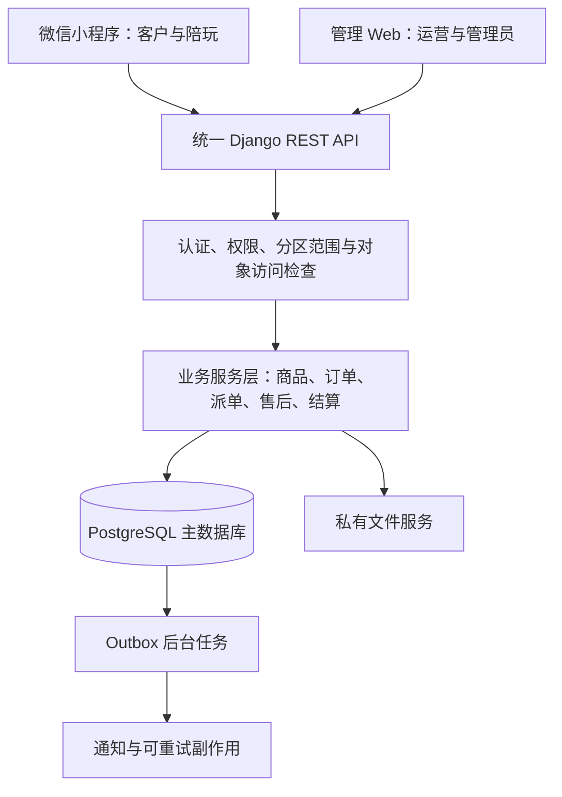

# 游戏陪玩俱乐部系统

## 最新实施进度（2026-09-23）

- 当前阶段为第三阶段本地模拟业务联调；本节覆盖下文旧的实施状态描述，不改变已确认的产品规则与推送确认要求。
- 已新增 `apps/admin/` 独立 Vue 管理端：登录、概览、游戏/类型/商品管理、图片上传、首页配置、订单只读查询和审计日志。Django Admin 目录与订单改为只读。
- 小程序已接入服务端商品详情、封面/数量范围、订单快照、收藏与登录态清理；频道、会话、余额积分仍属本地演示或未开放功能。
- Docker 重装后新建 PostgreSQL 17 开发库，全部迁移已应用；12项后端测试全部通过，含相同幂等键并发下单与并发付款。旧 SQLite 保留，不自动迁移。
- 小程序类型检查、3项测试、微信/H5构建和管理Web类型检查/构建已通过。真实浏览器完整验收、微信真机、后台并发编辑/上下架竞争、备份恢复仍未完成。
- 数据检查快照：4游戏、12类型、5商品、0首页配置、0订单；新库管理员和首页配置需要设置。本地 `.env`、数据库、媒体、依赖与产物不得提交。
- **2026-09-29 验收更新**：8 项手动双端验收清单已全部执行通过（API 23/23 断言 + 管理端/H5 浏览器 UI 截图）；过程中发现并修复 H5 端 API 基地址缺陷。数据快照现为 7游戏、16类型、7商品、6首页配置、1订单。详见 [notices/E2E验收报告.md](./notices/E2E验收报告.md)。
- **2026-09-29 P3 真实微信登录**：后端新增 `WechatIdentity` 模型（迁移 0006，`(appid,openid)` 唯一）、`core/wechat.py` code2session 封装、`POST /api/v1/auth/wechat-login/` 端点；小程序登录页改造（微信端 `uni.login` 取 code 调 wechat-login，H5 保留 dev-login）。AppSecret 仅存 `backend/.env`（已 gitignore），不下发前端、不落日志、openid 不落账号名。后端全量 21 项测试通过，type-check/build 通过，假 code 冒烟返回安全文案 40029。**真实联调已通过**：微信开发者工具点「微信登录」后，后端真实换取 openid 建号（`user_id=4`），身份/账号/Token 各 1 条，重登不重复建号。详见 [notices/P3-微信登录验收报告.md](./notices/P3-微信登录验收报告.md)。遗留：昵称/头像仍为默认「微信玩家」（code2session 已不下发，需 `wx.getUserProfile` 主动授权，属后续项）；生产域名白名单待上线配置。
- 完成度与操作步骤以 [第三阶段完成度与联调手册.md](./第三阶段完成度与联调手册.md) 为准；历史基线保留供追溯。
- `notices/` 用于保存问题原因、处理过程、验证证据和预防事项，不作为新的产品需求来源。

> 更新：2026-09-18。本文是产品与开发约束的当前依据。最新方向为“用户端小程序＋后台管理 Web＋统一 Python 后端”。技术方案尚未落地的部分均为规划，不代表已经实现。

> 页面决策：用户已明确选择 `design/index.html` 展示的温和配色版本，作为客户小程序后续页面实现与视觉验收的当前基准。对应 `design/01-首页.svg` 至 `design/08-登录.svg` 共 8 页。后续明确修订优先；此前未采纳的深色稿和旧 Vue 原型不作为实现依据。已明确的产品业务规则与技术方案继续有效。

> 采纳边界：已选设计采用暖白、浅灰紫和柔和绿色，包含首页四个快捷入口、频道话题列表、“我的”设置和通知图标及微信登录页。设计确认不等于功能已实现；目前仍为本地静态 SVG，尚未导入在线 Figma。会员、活动抽奖、考核等尚未展开的规则不因入口获选而自动确定。

> 项目现状、未完成清单、Web CRUD 与小程序数据统一方案见根目录 [项目现状与双端数据统一实施方案.md](./项目现状与双端数据统一实施方案.md)。其中仍未落地的接口、管理端、正式部署和跨端验收属于后续计划；关键业务决策仍以本文及用户后续确认保持一致。

## 1. 产品目的

为单个游戏陪玩俱乐部提供多游戏分区的客户服务与内部管理系统，统一管理服务展示、预约下单、派单、服务交付、售后退款和陪玩收益。

用户端优先开发微信小程序，后台管理端开发电脑优先的 Web 应用。两端调用同一套 Python 业务后端，共用 PostgreSQL 主数据库；账号、订单、商品、预约、售后和收益不在两端分别维护独立真值。

当前默认小程序面向客户，并为获授权的陪玩提供独立工作台；运营、接待和管理员使用 Web 后台。陪玩工作台的具体入口、页面与交互待用户提供设计后落实。

## 2. 当前阶段与交付边界

- 当前阶段：温和配色的 8 页客户设计已获选；用户要求优先开发小程序端基础交互，已创建 `apps/miniapp/`（uni-app＋Vue 3＋TypeScript），完成八页及共用二级内容页的本地演示交互。后续再接统一后端并补充尚未展开的业务规则；不以等待 Figma 文件作为采用该设计的前提。
- `design/` 内当前 8 页 SVG 是已选的静态设计基准，可导入 Figma，不代表已实现登录、下单或支付。
- 演示昵称、服务、价格均为占位内容，不代表真实商品、认证、成交量或服务承诺。
- 历史上曾建立 `frontend/` Vue 客户侧原型，本次检查工作区时该目录已不存在；旧原型未采纳，不恢复或迁移其页面与浏览器数据。
- 当前 `apps/miniapp/` 使用独立演示数据：订单修改、未读与会话草稿仅存内存，演示登录标记和收藏通过 `uni` storage 保存在当前设备。退出演示账号重置示例数据；本地数据不是正式业务真值。
- 已实现：首页游戏筛选、商品搜索、轮播与四入口；频道切换与话题搜索；会话搜索和草稿；我的、特价、订单、服务、登录及详情说明页；微信原生四项 TabBar、返回与登录后回到来源页面。具体路由和运行方式见 `apps/miniapp/README.md`。
- 当前已建立 Django＋DRF 后端和第一版数据库闭环：开发模拟登录、商品／游戏查询、收藏接口、订单创建／查询／取消、服务端模拟付款、价格版本校验、商品快照、幂等记录与订单状态历史。小程序已接入目录加载、开发登录、订单创建、订单查询和模拟付款；真实微信身份、预约档期、陪玩派单、真实支付、实时聊天和管理 Web 仍未完成。抽奖、考核、会员、余额、积分和加入入口继续展示待开放说明。
- 后端 `python manage.py check`、数据库迁移计划、3 项 API 流程测试和小程序 TypeScript 检查已通过；H5／微信构建在当前 Windows 环境因 `spawn EPERM` 未完成，仍未进行微信开发者工具或真机验证。小程序真实 AppID 留空，H5 是同源页面的检查工具，不是正式客户 Web 端。
- 后续阶段：补齐收藏 API 联调与管理 API 验收 → OpenAPI 产物及管理 Web → 预约／派单／售后／结算 → 真机与正式 PostgreSQL 部署验收。后续如提供 Figma，记录其与当前设计的版本对应关系。
- Figma 在线文件仅在连接成功并实际创建后记录链接，不将本地 SVG 表述为已上传的 Figma 文件。

## 3. 作用范围

### MVP 包含

- 多游戏分区、服务商品、陪玩资料、账号与角色权限。
- 预约下单，单陪和多陪，指定意向陪玩。
- 模拟支付成功、失败与取消流程。
- 人工派单、陪玩确认、预约冲突检查、客户确认换人。
- 服务开始、提交完成、客户验收、一次订单评价。
- 售后案件、文字和图片凭证、部分／全额模拟退款、管理员复核。
- 统一抽成、实际服务人员均分、收益冻结和模拟结算。
- 分区及日期维度基础统计、关键操作日志。

### MVP 不包含

真实支付、真实提现、会员余额、短信、实时聊天、抢单大厅、自动排班、推广分销、多俱乐部租户体系和正式客户 Web 端。微信小程序已纳入 MVP；现有客户 Web 属于暂不采纳的历史演示。

已选设计中的频道、消息、会员、余额、收藏、积分、加入、抽奖和考核入口属于已确认的页面结构；其中超出上述 MVP 的业务能力仍需单独确定规则与实现阶段。不能因设计中有入口而默认开通实时聊天、资金账户、抽奖发奖或考核授予角色。未接入的功能应明确展示未开放或演示状态，不伪造成功结果。

## 4. 角色与权限

| 角色 | 默认入口 | 职责 | 数据范围 |
| --- | --- | --- | --- |
| 客户 | 微信小程序 | 浏览、预约、模拟支付、验收、售后、评价 | 自己的订单 |
| 陪玩 | 小程序内陪玩工作台 | 更新介绍、接受或拒绝派单、服务交付、查看收益 | 自己参与的订单 |
| 运营／接待 | Web 后台 | 派单、改派、上架管理、服务跟进、售后及退款 | 管理员授权的游戏分区 |
| 管理员 | Web 后台 | 账号、角色、分区、价格、抽成、全局复核和结算 | 全部数据 |

- 一个账号允许兼任多个角色；小程序用户通过微信登录建立客户身份，工作人员身份只能由管理员授予。
- 角色操作权限与分区范围共同决定可访问数据，后端必须校验，不以隐藏按钮代替权限检查。
- 列表、详情、统计、文件下载和业务动作均检查权限。小程序和 Web 的不同响应可以展示不同字段，但同一订单的金额、状态和版本必须来自同一业务记录。
- 小程序角色切换和 Web 菜单只影响展示，不能提升权限；不能相信客户端提交的角色、客户 ID、分区范围或收益金额。
- 管理员可配置角色并勾选预定义权限，MVP 不实现字段级权限。
- 运营不能定价，陪玩不能自行定价或授予自己接单资格。

## 5. 游戏归属规则（关键约束）

- **每位陪玩只服务一个游戏，只能绑定一个游戏分区。**
- 陪玩列表、意向人选和派单候选人均按所属游戏过滤。
- 每笔订单只属于一个游戏分区；客户可以分别购买不同游戏的服务。
- 同一订单的全部陪玩必须属于订单游戏分区。
- 仅管理员可以更换陪玩所属游戏；存在未结束预约或服务时禁止调整。
- 调整归属不修改历史订单的游戏信息、人员记录或收益记录。

## 6. 商品与计费

- 管理员维护商品：游戏、名称、说明、单价、单位、购买数量范围、服务人数、预约时长说明、验收条件和上架状态。
- 单位支持小时、天、局、目标／套餐；目标／套餐按一次购买。
- 订单总价 = 商品单价 × 购买数量。单价包含商品约定的全部陪玩人数，不能再次乘人数。
- 单陪和多陪作为不同商品配置；不根据实际游戏时长自动扣费。
- 下单保存商品说明、价格、人数、验收条件、抽成比例和售后时限快照。
- 付款后不直接改价或修改服务内容，需要调整时退款并重新下单。
- 数据库和 API 中所有金额使用整数分（如 `total_amount_cents`），界面才换算为元；抽成比例用整数基点（10000 表示 100%）。禁止浮点数参与交易记账。
- 金额、抽成、退款和结算由后端计算。小程序和 Web 的试算仅用于即时展示，提交后必须以服务端返回值为准。

## 7. 预约与订单

1. 客户选择商品、数量、起止时间，填写游戏昵称／区服、联系信息及服务需求。
2. 可指定部分或全部意向陪玩；人数不超过商品人数且必须属于同一游戏。
3. 模拟付款后进入待安排。付款仅代表提交预约申请，不代表预约成功。
4. 运营派出足额人员，每位陪玩分别接受或拒绝，全部接受后才预约成功。
5. 接单以数据库事务检查和占用档期；同一陪玩不能同时接受重叠预约。
6. 有人拒绝时保留其他人员的接受记录，运营补派；取消和移除人员释放档期。
7. 更换指定人员，或改变已确认的人员／时间，必须由客户确认后生效。
8. 陪玩分别提交服务开始与完成记录，所有当前服务人员完成后等待客户验收。
9. 客户确认后完成订单；MVP 不自动验收，管理员人工确认须提供处理说明。

按天或分段服务必须保存实际服务时间段列表，分别做冲突检查；不能把跨多天的首尾时间整体当作连续占用。客户提交的是意向时段，最终安排由运营确认。多人的开始、完成和退出记录分别保存，不因某一人点击完成就结束整单。

订单主状态：待付款 → 待安排 → 待接单 → 已预约 → 服务中 → 待客户确认 → 已完成；另设已取消、已终止。

支付、退款、售后、结算状态分别记录。换人保留原参与者与其服务记录，不覆盖历史。

## 8. 模拟支付与售后

- 模拟支付提供成功、失败、取消三个路径，全程明确标识模拟环境，不接受真实资金。
- 后端计算应付金额；重复请求不能重复收款、退款或结算。
- 未付款可以直接取消；已付款但未开始，由运营审核取消并模拟全额退款。
- 服务中可申请换人、继续履行或终止，并由运营记录协商结果与退款依据。
- 交付争议依据订单中的验收条件和服务证据处理；客户可请求管理员复核。
- 默认可在服务期间、待验收期间和完成后 48 小时内发起售后，时限可配置并随订单保存。
- 同一订单同时只允许一个处理中售后案件；未解决期间冻结收益。
- 退款不得超过剩余可退金额，计算时同时扣除已成功退款与处理中已预留退款。模拟退款成功才更新累计退款和净收入；失败保留记录，确认失败后释放预留；状态未知时先查询，不直接再次发起。
- 图片凭证只允许相关参与者和授权工作人员访问；校验真实图片格式并限制文件大小。
- 售后窗口结束后的争议保留人工联系入口，MVP 不做已结算订单自动追偿。

## 9. 收益与结算

- 管理员设置统一抽成比例，订单保存下单时比例。
- 净收入 = 模拟实收 − 已成功模拟退款。
- 陪玩收益池 = 净收入 − 俱乐部抽成；由实际开始服务的陪玩均分。抽成按整数基点计算并四舍五入到分，计算规则只在后端实现。
- 未开始服务者不分成；开始后被替换者保留参与资格。分币余数按参与记录顺序分配。
- 订单完成、售后时限已过且不存在待处理售后、处理中退款或支付状态未知，才能结算。售后申请、退款与结算需锁定同一订单检查，不能互相穿透。
- 管理员执行模拟结算，生成不可重复的流水；不提供真实提现。

## 10. 技术选型与代码组织

### 10.1 技术决策

| 层次 | 选择 | 原因与边界 |
| --- | --- | --- |
| 用户小程序 | uni-app（Vue 3＋TypeScript），编译到微信小程序 | 延续现有 Vue 技术栈；采用小程序组件、页面生命周期和导航，不能直接搬用浏览器 DOM、Vue Router 或 Element Plus |
| 小程序 UI | 原生小程序能力＋按已选温和设计封装的业务组件 | 以 `design/` 当前预览与 SVG 为视觉依据；后续 Figma 修订按版本对齐，不预先绑定整套视觉组件库；导航栏、分包和授权交互按微信端实际能力实现 |
| 管理 Web | Vue 3＋TypeScript＋Vite＋Vue Router＋Pinia＋Element Plus | 独立后台工程；Element Plus 负责表格、表单等管理交互，视觉按后续 Figma 适配 |
| 后端 | Python 3.12 最新安全补丁＋Django 5.2 LTS＋Django REST Framework | 保留 Python 作为核心业务语言，使用模块化单体，先不拆微服务 |
| 业务数据库 | PostgreSQL 17，锁定维护补丁版本 | 唯一业务真值；承担事务、外键、唯一性、金额约束与预约冲突约束 |
| 接口契约 | REST JSON `/api/v1/`＋drf-spectacular 输出 OpenAPI 3 | 同一套状态、字段、单位与错误码定义；生成两端共用 TypeScript 类型 |
| 客户端请求 | 小程序封装 `uni.request`；Web 封装 `fetch` | 共享接口类型与错误约定，各端保留平台专属传输和认证适配；不假设浏览器 SDK 可直接运行在小程序 |
| 后台任务 | PostgreSQL Outbox＋独立 Django worker 进程 | 处理需可靠重试的事件、通知等；MVP 不要求 Redis、Celery 或消息中间件 |
| 文件 | 后端文件服务＋私有存储，部署时使用 S3 兼容对象存储 | 开发可用私有本地目录；存元数据和访问权限，不把售后截图作为公开静态资源 |
| 部署 | Linux＋Docker Compose＋Nginx＋Gunicorn | Web 与 API 通过同一 HTTPS 站点反向代理；小程序经 HTTPS 访问同一 API；开发环境可继续使用 Windows |

选择 uni-app 是项目决策，目的是复用 Vue 开发经验和类型，不意味着现有网页可无修改转换。仅把微信小程序列为当前发布目标，不提前承担多平台适配。uni-app 编译器依赖以官方 Vue 3 模板兼容组合锁定，不强行和管理 Web 共用相同 Vite 版本。[uni-app 官方说明](https://uniapp.dcloud.net.cn/quickstart-cli)、[编译器说明](https://uniapp.dcloud.net.cn/tutorial/compiler)

Django 5.2 属于 LTS，并支持 Python 3.12；实际初始化时锁定兼容依赖和补丁版本。[Django 官方说明](https://docs.djangoproject.com/en/5.2/releases/5.2/)

### 10.2 逻辑架构与职责



- 展示层负责交互、输入提示、请求与显示；不决定订单价格、付款成功、状态流转、接单资格或退款额度。
- API 层负责认证、序列化和调用业务服务，避免在不同端的 View 中各写一套订单规则。
- 业务服务层集中实现 `create_order`、`assign_companions`、`accept_assignment`、`confirm_change`、`confirm_delivery`、`approve_refund`、`settle_order` 等动作。
- 模型和数据库负责持久化与最终约束；列表、详情、余额与结算读主库，MVP 不引入有复制延迟的读库。
- 同一业务动作无论来自客户、陪玩、后台、任务或支付结果处理，必须复用同一服务层；Django Admin 也不得直接绕过服务层修改财务和订单状态。
- 以模块化单体和短事务处理当前业务。共享数据库并不自动防止并发错误，仍须执行下文的一致性规则。

### 10.3 业务模块与核心关系

| 模块 | 核心数据／职责 |
| --- | --- |
| accounts | 统一 User、微信身份绑定、角色、权限、运营分区授权 |
| catalog | 游戏分区、商品、版本、计费与验收规则、陪玩档案；每个陪玩档案仅一个当前游戏 |
| orders | 订单、商品及规则快照、独立主状态、客户确认、评价、版本号 |
| scheduling | 派单批次、逐人接受／拒绝、实际预约时间段、人员／时间变更方案、逐人服务记录 |
| payments | 模拟支付适配器、支付尝试、结果记录、退款请求、业务流水与幂等记录 |
| aftersales | 售后案件、凭证、协商结果、退款审核、管理员复核 |
| settlements | 抽成和均分、收益冻结、可结算检查、结算批次与明细 |
| audit／outbox | 操作日志、状态历史、待投递事件与重试记录 |

- `User 1:1 CompanionProfile`（可选），`CompanionProfile N:1 GamePartition`，不使用陪玩与游戏的多对多关系。
- `Order N:1 Customer`、`Order N:1 GamePartition`；每单一项服务商品，多人通过多条 Assignment 表达，不复制订单。
- Assignment 同时记录邀请状态、接受时间、服务开始／结束和替换关系；历史人员记录不因换人或转游戏被覆盖。
- Order 关联多个支付尝试、退款及历史售后案件；同一时刻最多一个处理中售后。原型“每单只显示首个售后”的限制不作为正式数据模型约束。
- 订单主状态与支付、退款、售后、结算状态独立存储；对外展示状态由后端按统一规则派生，不能让两端自行组合出不同结果。
- 接单、派单和调整游戏归属共用锁定约定；在事务内重新检查陪玩当前游戏、资格和活跃任务。

### 10.4 统一身份与权限

- 以内部 `user_id` 关联订单和角色。微信身份使用 `(appid, openid)` 唯一绑定到内部用户；不依赖昵称、头像或前端传来的 openid 识别用户，不假定一定能获得 UnionID。
- 小程序通过微信临时登录 code 请求后端换取本系统登录态。AppSecret、微信会话密钥和平台凭据只在服务器处理，不返回客户端。
- 小程序采用 DRF＋SimpleJWT：Access Token 默认 10 分钟、Refresh Token 默认 7 天，开启刷新轮换与黑名单；客户端统一串行刷新，避免多个并发请求重复轮换。
- 注销吊销刷新令牌并清除本地登录态；短期访问令牌不因刷新令牌被吊销而立即失效，依其有效期或服务端账号停用处理。鉴权每次查询账号状态，权限从数据库读取，不信任 JWT 内的旧角色声明。
- Web 后台采用 Django Session＋Secure/HttpOnly Cookie＋CSRF；同域部署避免不必要的跨域 Cookie 复杂性。Web 和小程序的认证方式可不同，最终都映射到同一个 User 和同一权限策略。
- 按 API 分组明确允许的认证方式；管理接口只允许后台登录身份与管理权限，小程序令牌不能因具备某个普通角色就访问后台操作。
- 员工账号由管理员创建。已有后台账号与微信身份的绑定必须由已认证账号发起并验证另一端身份，不能按同名或手机号相似自动合并。
- 角色／分区授权变更后，下次请求立即按新权限校验；客户端刷新菜单只是界面更新，不是权限控制。

轮换与黑名单需要显式开启，不能依赖默认配置。[SimpleJWT 设置](https://django-rest-framework-simplejwt.readthedocs.io/en/stable/settings.html) 列表过滤、对象访问与业务动作需分别实现权限校验，不能只使用 `IsAuthenticated`。[DRF 权限文档](https://www.django-rest-framework.org/api-guide/permissions/)

### 10.5 两端数据一致性（必须遵守）

**目标分为两层：数据库中的业务结果必须一致；两个已经打开的屏幕允许短暂刷新延迟，不能承诺断网或后台挂起时仍实时同步。**

#### A. 一份业务真值与统一接口

- 小程序和 Web 都只读写同一个业务后端；不能各自建订单库，也不能将 `localStorage`、Pinia 或小程序 storage 中的订单当作服务端记录。
- MVP 订单详情、可退金额、档期、结算资格均读主数据库，不加应用层业务缓存。静态资源可缓存；以后如增加商品缓存，必须在提交时重验商品版本和上架状态。
- API 统一输出 ID、金额分、币种 `CNY`、状态枚举、`version`、`updated_at`。时间存为 UTC，API 返回带时区的 ISO 8601；默认按 `Asia/Shanghai` 展示，服务端时钟决定截止时间。
- Django/DRF schema 是字段及枚举契约来源，用 OpenAPI 生成小程序和 Web 的 TypeScript 类型；两端只维护展示文案，不手写各自独立的状态含义。[OpenAPI 工具说明](https://drf-spectacular.readthedocs.io/en/stable/readme.html)
- 更新小程序存在审核和版本滞后，`v1` 内优先新增兼容字段；破坏性修改使用新 API 版本并保留旧版本过渡期，不能要求后台发版时所有用户同时升级小程序。

#### B. 事务、状态机与锁

- 价格快照、订单写入、相关流水、状态历史和审计，在同一个 `transaction.atomic()` 中成功或回滚。
- 所有订单动作先取得订单行锁，重新检查权限、当前状态、版本和金额条件，再执行状态转换。不能先在锁外判断，再无条件写入。
- 涉及多个陪玩或时间段时，按稳定 ID 顺序加锁，减少死锁；锁等待和冲突应转换为可理解的业务错误。
- 不提供允许客户端任意 PATCH `status`、`paid`、`refund_total`、`earnings` 的接口；只提供有明确合法前置条件的动作接口。
- 通过唯一约束、检查约束和外键补充应用校验：业务单号唯一、同一支付结果只记一次、结算明细唯一、同一订单至多一个处理中售后、金额非负。

Django 的 `atomic()` 管理原子提交；`select_for_update()` 在事务中锁定数据。外部网络调用不放在持锁事务内。[事务文档](https://docs.djangoproject.com/en/5.2/topics/db/transactions/)、[行锁文档](https://docs.djangoproject.com/en/5.2/ref/models/querysets/#select-for-update)

#### C. 防止两端覆盖彼此的修改

- 订单和商品等可并发操作记录有整数 `version`。改变客户可见状态、安排、金额或售后的动作必须增加相应订单版本。
- 管理端和小程序提交状态相关操作时携带 `expected_version`；服务端在锁内比对，不一致返回 `409 VERSION_CONFLICT`，两端拉取最新记录后让用户重新确认，不静默覆盖。
- 创建订单提交 `product_id`、购买数量和用户看到的 `expected_product_version`，金额由后端按当前商品算出。商品已改价或下架时返回冲突，不按旧页面价格或悄悄提高的价格成交。
- 订单创建后使用其商品与价格快照；商品改价只影响后续新单。不能用最新商品价格覆盖历史订单明细。
- 变更人员／时段用独立变更方案，保存提案版本和客户确认状态。等待客户确认不修改当前有效安排；确认时重查人员资格与档期，失败时保留原安排并提示重新协商。

#### D. 重复提交和请求超时

- 创建订单、付款、退款、结算等写操作使用 `Idempotency-Key`。同一业务意图只生成一次 key，网络重试复用原 key，不能每重试一次就生成新 key。
- 后端将 key、操作者、动作、资源、请求摘要和结果持久化并设唯一约束。同 key、同请求返回原结果；同 key、不同参数返回 `409 IDEMPOTENCY_CONFLICT`。鉴权仍须每次执行。
- 同 key 请求处理中时返回可识别的处理中结果并允许查询；后端崩溃后根据业务流水恢复或重试，不能留下永久占位或重复执行。
- 网络超时不等于操作失败。界面显示“结果确认中”，使用原 key 重试或查询操作结果；查询幂等记录的接口也校验操作者，不泄露其他人的结果。
- 防重复按钮仅改善体验；正确性依赖数据库幂等、业务唯一约束和状态机。支付／退款的业务唯一性不能随短期幂等记录清理而失效。

#### E. 多人预约不撞单

- 预约以每位陪玩的实际时间段保存，区间采用 `[开始, 结束)`，允许前一单结束时间等于后一单开始时间。
- 陪玩接受派单时，在事务内检查游戏归属、资格、人数和档期，并建立有效占用；待邀请不占用档期。已接受的部分人员占用保留，直到订单取消、人员移除或改派释放。
- 使用 PostgreSQL 范围类型和排斥约束，阻止同一陪玩的有效时间段重叠；迁移明确启用所需的 `btree_gist` 扩展。发生约束冲突时整笔接单事务回滚并返回 `409 SCHEDULE_CONFLICT`。
- 最后一位接受时，在订单锁内复核足额人员均已接受，再将订单变为已预约。两名运营不能并发把同一订单派出超过需求的人数。
- 人员替换、预约调整在同一事务内校验并替换相关占用；失败时原安排继续有效。分日服务检查每个实际时段，不锁住所有休息时间。

范围排斥约束适合防止预约区间重叠。[PostgreSQL 范围约束](https://www.postgresql.org/docs/17/rangetypes.html#RANGETYPES-CONSTRAINT)

#### F. 支付、退款与结算一致

- 第一阶段仅接服务端 `MockPaymentProvider`，模拟结果经过与正式业务相同的金额核对、幂等及订单服务；小程序不能直接写“已支付”。模拟接口仅在隔离的开发／演示环境开放，线上正式配置应禁用。
- 付款成功同时记录成功支付流水和订单已付状态；发生部分错误时一起回滚。同一订单只能形成一份有效全额付款，重试不能重复计入实收。
- 退款审核锁定订单，先预留可退金额并创建退款请求。退款成功时一次性更新流水、累计退款、订单状态及收益重算；明确失败才释放预留，未知结果继续阻止结算。
- 部分退款以净实收重算分成，全额退款收益归零；结算必须再次在订单锁内检查售后时限、退款和结算状态，同一订单不能被两个任务重复结算。
- 后续接真实支付时，客户端支付返回只能触发查单，不能单独作为成功依据。验证渠道结果的真实性及订单号、金额、币种、环境，并对重复／乱序结果幂等处理。
- 外部渠道调用采用“先持久化请求 → 事务外调用 → 可信回调／查询确认 → 短事务落账”。超时用同一商户业务号查单与重试，不承诺本地事务与外部渠道天然原子提交；不一致进入对账处理。

#### G. 页面怎样及时看到另一端的变化

- 写操作成功后返回后端最新资源与版本；发起端立即更新详情，并使相关列表、计数和待办失效后重查。
- 小程序页面 `onShow`、下拉刷新、断网重连后重查；Web 返回前台、路由进入和操作完成时重查。
- MVP 在前台打开的活跃订单／派单／售后页面默认每 5 秒轮询，普通列表默认每 15 秒；页面隐藏时停止轮询，恢复时立即刷新。失败退避并标记更新失败，不能把旧数据展示为已确认最新。
- 在正常联网和服务可用时，另一端应在下一次成功刷新中看到已提交变化；上述间隔是刷新策略，不是断网情况下的强实时保证。
- 每个资源只接受不低于当前版本的响应，防止慢请求的旧结果覆盖新结果。切换账号、分区或查询条件时取消／忽略旧请求，避免错显数据。
- 请求完成前显示处理中；离线只允许查看标记为缓存的数据、保存表单草稿，不离线创建正式订单、接单或执行退款。恢复网络后重查再提交。
- 后续需要秒级推送时可增加 WebSocket；推送仅通知“哪个资源发生变化”，客户端仍从 API 查询完整最新状态，断线后用查询补偿。MVP 不以 WebSocket 作为一致性前提。

#### H. 可靠事件与可追溯

- 必须可靠送达的通知事件与业务修改一起写入 PostgreSQL Outbox；worker 提交后读取并投递，支持任务认领、超时回收、重试次数及失败记录。
- 消费端按事件 ID 去重，遵守“可能重复投递”的语义；事件处理失败不重复执行支付或退款，也不回滚已经成功的订单。
- `on_commit()` 可以唤醒处理，但不能单独代替持久化 Outbox，避免进程在提交后退出而丢失通知。通知未送达不影响用户查询已提交的业务真值。
- 日志携带 `request_id`、订单 ID、操作人、版本和动作；后台可查看退款未知、事件重试等异常。日志不得记录明文凭据或完整私人联系信息。

### 10.6 API 分组和协作约定

- `/api/v1/auth/`：小程序登录、刷新／注销、后台登录、当前用户与权限。
- `/api/v1/catalog/`：游戏、服务与公开陪玩资料。
- `/api/v1/me/`：客户订单与评价；`/api/v1/companion/`：陪玩派单和服务记录；`/api/v1/management/`：分区运营和管理员能力。
- 端点允许按角色区分可见字段及动作，但必须调用同一业务服务、同一订单和相同状态转换规则，不复制核心业务逻辑。
- 对接前在 OpenAPI 定义金额单位、状态枚举、权限、分页、字段校验、幂等要求和状态冲突响应。业务失败返回正确 HTTP 状态与稳定错误码，不能全部返回 `200` 加一段消息。
- 典型冲突码：`VERSION_CONFLICT`、`SCHEDULE_CONFLICT`、`INVALID_ORDER_STATE`、`REFUND_AMOUNT_EXCEEDED`、`IDEMPOTENCY_CONFLICT`。响应带 `request_id`，前端给用户可理解的提示。
- 客户不能指定最终实付、用户归属、成功状态或收益；后端对请求中未授权的字段拒绝或按接口白名单忽略，禁止直接把请求整体写入模型。

### 10.7 计划目录与现有代码处理

```text
Agent.md                 当前产品与架构约束
frontend/                历史 Web 演示目录，本次检查已不存在，不恢复
design/                  已选温和配色版本：8 页 SVG、总览、预览与设计包
backend/                 已建立：Django 项目、DRF API、模型、迁移、开发种子数据和测试
apps/miniapp/            已建立：uni-app 微信小程序基础页面与本地演示交互
apps/admin-web/          计划：Vue 管理后台
packages/api-contract/   计划：OpenAPI 产物、共享 TS 类型；当前类型暂在小程序 API 目录维护
docs/                    计划：页面映射、状态图、联调与部署说明
deploy/                  计划：Compose、Nginx 和环境配置样例
notices/                 工程问题记录：保存已复现问题、根因、修复方式和验证结果，供后续排查与回归使用
```

- 当前已创建 `apps/miniapp/`；其余计划目录在进入对应实现阶段时创建，不宣称已经存在。
- 正式业务流程依据本文中已确认的规则与用户后续说明梳理，不能从旧 `frontend/` 的页面、按钮或示例倒推需求；订单、状态机、价格和退款在服务端实现，不能把浏览器 store 当作后端。
- 原型 localStorage 不自动导入正式库，正式联调使用显式的服务端演示种子数据。正式构建不内置模拟运营按钮或通过查询参数提权。
- 两端共享 API 类型和必要的无平台工具，页面、路由、登录存储和网络适配分别实现。小程序不用 DOM API、浏览器 storage 或 Vue Router。
- 开发、测试、正式环境隔离数据库、文件存储和微信配置；各端构建只连接指定环境。秘密凭据只由后端环境变量注入。
- PostgreSQL 持久卷与备份、日志和恢复说明随部署交付；容器存在不等于数据已备份。

## 11. 页面设计来源与采纳边界

### 11.1 当前已选设计与视觉规范

- 设计版本：2026-09-18 温和配色版；预览为 `design/index.html`，独立页面为 `design/01-首页.svg` 至 `design/08-登录.svg`，总览为 `design/全部页面.svg`，导入包为 `design/Figma-SVG.zip`。这些本地文件已获选，不再标记为待采纳历史稿。
- 暖白背景 `#F6F5F2`、白色卡片 `#FFFFFF`、浅灰紫面板 `#E6DEEF`；主文字 `#303345`、次文字 `#747486`；图标及强调色 `#8875AA`、主按钮 `#80699E` 配白字、优惠价格使用柔和绿色 `#537866`。延续圆角卡片、轻量线性图标和现有留白，不恢复深色高对比方案。
- 画稿基准宽度为 390；首页为 390×928，其余页面为 390×844。高度表示设计内容范围，不要求设备固定高度；实现时处理内容滚动、底部导航和安全区，避免遮挡。
- 预览品牌为“游伴 CLUB”，按当前稿呈现；正式品牌资产、商品封面、昵称、ID、价格、余额、积分和讨论数量仍需替换为确认内容或真实数据，不能将示例解释为真实承诺。
- 为每页建立“SVG 文件／后续 Figma 节点 → 页面路由 → 操作角色 → API → 业务状态 → 验收”的映射。当前不创建或发布 Figma；后续接入时记录版本，不自动推翻已选设计。
- 页面需覆盖加载、空列表、错误、断网、无权限、处理中、成功及状态冲突；静态稿未给出的基础状态沿用同一设计体系，涉及收费或权限等关键歧义时再询问用户。
- 小程序导航栏、安全区、TabBar、页面栈与管理 Web 的菜单、面包屑、响应式布局分别处理，不能用 CSS 简单缩小网页代替小程序适配。
- 开发完成后进行截图对照；小程序除开发者工具外需进行真机检查。没有完成微信端构建和真机验证时，不将 H5 预览标记为小程序已交付。

### 11.2 八页结构与入口

| 页面／设计文件 | 已选内容与布局 | 跳转及边界 |
| --- | --- | --- |
| 首页 `01-首页.svg` | Logo、顶部游戏分区导航、轮播图、四个横向快捷按钮、特价区、热门区、底部导航 | 四按钮按“活动抽奖、下单流程、客服中心、考核中心”顺序，位于轮播图与特价区之间；特价“更多”进入特价页；其余二级页面尚未提供完整设计 |
| 频道 `02-频道.svg` | 顶部搜索栏、左侧游戏选择栏、所选游戏介绍与组队推荐、发现频道话题列表、底部导航 | 保留顶部搜索，删除侧栏独立搜索图标；发现频道直接列出话题和讨论信息，不再拆为“组队大厅／日常闲聊”等分类卡片；话题详情及互动规则待补充 |
| 消息 `03-消息.svg` | “会话”标题、对话搜索、消息列表、未读提示、底部导航 | 聊天详情、消息发送和实时通信尚未实现；不将静态会话样例当作实时聊天已纳入 MVP |
| 我的 `04-我的.svg` | 头像、名称、ID；右上角设置与通知图标；会员栏；五类订单入口；四项服务入口；底部导航 | 会员栏保持筹备中；订单入口进入订单页对应筛选，全部服务进入服务页；设置和通知二级页面待补充 |
| 特价 `05-特价.svg` | 特价标题及活动文案、游戏筛选与价格排序入口、双列特价商品 | 展示优惠价和原价；折扣、活动有效期及排序以服务端确认数据为准，不采用示例价格作为业务规则 |
| 订单 `06-订单.svg` | 待付款、待发货、待收货、评价、退款／售后五个筛选；商品及金额信息；订单动作 | 当前画稿展示待付款样例、取消订单和立即付款；其余筛选的状态内容须按 11.3 映射，不直接改写后端状态机 |
| 服务 `07-服务.svg` | 余额查看及明细入口、我的收藏、积分中心、我要加入 | 四项均保留；余额及积分为示例，加入流程不自动授予陪玩权限；明细、收藏列表、积分规则与加入表单待补充 |
| 登录 `08-登录.svg` | 品牌展示、微信一键登录、未勾选的协议选择框、用户协议／隐私政策、首次登录提示、先逛逛、联系客服 | 微信登录接统一后端身份体系；先逛逛进入公开浏览，涉及个人数据或写操作时按鉴权要求引导登录；协议正文与客服接入待补充 |

- 首页、频道、消息、我的共用底部四项导航，名称和顺序固定为“首页、频道、消息、我的”，显示当前选中项；特价、订单、服务使用返回入口，登录不展示主 TabBar。
- 首页快捷按钮为同一行四个入口，不能移入特价商品列表或省略其中某项；登录页协议不默认勾选。
- 登录成功后的返回来源、搜索范围、列表分页、各二级页参数与返回行为在页面映射阶段细化；静态预览不代表这些交互已可执行。

### 11.3 设计与业务状态的衔接

- 已选页面中的“待发货／待收货”为用户指定的展示标签；本项目售卖陪玩服务，不据此新增物流、快递或实物发货业务。第 7 节的订单主状态及独立支付、退款、售后、结算状态继续有效。
- 待付款对应未付款订单；“待发货”如何归并待安排、待接单、已预约，“待收货”如何归并服务中、待客户确认，需在 API 契约阶段明确并确认，不能仅凭名称自行改写状态机。评价需区分待评价／已评价；退款／售后按独立案件与退款状态展示。
- 会员权益、余额能力、积分获取／兑换、加入申请、活动抽奖和考核流程尚未展开。抽奖资格、次数、奖品、考核标准、审核权限等列为待定，不由示例 UI 推定。
- 下单流程和客服中心已确认入口；内容说明、客服接入方式及其与消息页的关系待细化。消息与通知图标不能替代可靠业务通知和权限校验。
- 视觉实现遵循已选稿，价格、权限、预约、派单、售后和一致性仍遵循后端业务规则。若新增功能改变 MVP 范围，明确记录决策后再扩展；演示环境必须标记模拟结果。

### 11.4 历史页面处理

- 旧深色版本、旧“夜航俱乐部”稿及 `frontend/` 历史 Vue 原型仍未采纳；不以其页面、路由和示例倒推需求。此约束不适用于本次已选的温和版本。
- 仅在用户明确要求时复用历史产物的指定部分；不删除或搬移用户文件，也不因采用新视觉而迁移浏览器演示数据到正式业务库。
- 陪玩工作台与管理 Web 尚未获得对应页面设计，后续分别确认，不能直接套用客户八页设计推定其权限和操作流程。

### 11.5 基础交互实现记录（2026-09-18）

- 四个主页面使用原生 TabBar；特价、订单、服务、登录以及共用二级详情页通过小程序页面栈导航。真实微信胶囊和状态栏留出空间，长页面滚动显示内容。
- 登录页协议默认未勾选；按钮明确标注“微信登录（演示）”，仅进入本地示例账号，不调用微信登录或获取个人身份。可先逛逛，订单、消息、个人服务和写操作需要演示登录；登录成功回到原入口。受保护二级页直接访问也显示登录提示。
- 商品详情支持数量 1～5 的 UI 演示、收藏及创建演示订单。数量范围只是演示限制，不替代第 6 节正式商品配置；当前未实现预约表单或档期校验。
- 订单页包含五类样例；取消、模拟付款、模拟完成与模拟评价均先提示演示含义，不能重复对已付款／已取消示例执行付款。分类转换仅用于验证 UI，不是第 7 节后端状态机或第 11.3 节待确认映射。
- 会话可搜索、打开和清除演示未读，输入内容仅保存为当前会话草稿，不发送给他人。话题可搜索和浏览示例详情，未开放发布或回复。
- 首页四入口均可进入相应说明页；客服中心提供下单、售后和加入说明，未连接人工客服。会员与其他未开放能力不显示虚假成功。
- H5 自动检查覆盖四入口、筛选空态、协议拦截、登录返回、订单演示、收藏空态、会话草稿、退出与受保护直达页，并检查 320px／390px／1440px 宽度下无横向溢出。检查脚本及截图路径见小程序 README；这不替代微信平台及真机验收。

## 12. 验收标准

以下是正式 MVP 的目标，未全部实现。旧 Vue 原型的检查仅为历史验证记录，不代表用户接受旧设计，也不替代新页面的验收。

- 至少两个游戏分区可独立完成订单流程，运营不能越权访问其他分区。
- 陪玩不能跨游戏接单，多人不足或未全员接受不能预约成功。
- 并发接单不产生档期冲突；支付、退款、结算幂等。
- 修改商品和抽成不改变历史订单；退款与多人均分金额一致。
- 换人须确认，历史可追溯；售后未结案不允许结算。
- 客户、陪玩不能通过接口读取无权访问的订单、凭证或收益。
- 电脑和手机无横向溢出，基本交互可操作；前端类型检查和构建通过。
- 客户页面的视觉验收以已选温和版 `design/index.html` 和对应 8 页 SVG 为基准，后续明确修订优先；不使用旧深色稿或旧 Vue 页面截图作为基准。静态稿未覆盖的交互按确认后的页面／API 映射验收。
- 核对首页四入口的顺序与位置、频道侧栏无搜索图标且话题不分卡片、“我的”设置与通知双图标、四项底部导航、登录页协议未默认勾选；会员及其他未接入能力不得显示虚假的业务成功。

### 跨端联调必须验证

- 小程序创建预约后，Web 后台查询到同一订单 ID、商品快照、金额和状态；后台派单后，小程序刷新可看到相同安排与版本。
- 两名运营同时修改同一订单：只有基于有效版本的修改成功，另一请求得到冲突；不能最后写入者静默覆盖前者。
- 陪玩同时接受两个重叠订单、两人同时接受一个多人订单的最后名额、管理员调整游戏归属与接单并发时，数据库保持游戏归属、人数和档期约束。
- 改价与下单并发：旧版本请求需要重新确认，已生成订单仍保留原快照。
- 模拟付款、退款和结算重复请求／乱序结果／响应丢失后重试，只形成一次有效业务结果；超时页面可通过查询恢复。
- 退款和结算并发、多个退款并发、提交售后与结算并发，不能超退、提前结算或重复分配收益。
- 后台撤销角色或分区权限后，两端旧页面下一次操作被后端拒绝；不能通过改 URL、资源 ID 或客户端角色字段越权。
- 人为延迟旧请求、网络断开重连、切换账号和小程序前后台切换时，旧响应不能覆盖新状态，不显示未确认的成功。
- 事务中注入失败、提交后 worker 退出再恢复时，核心业务不半完成，待通知事件不丢失且重复处理安全。
- 微信开发者工具与真机验证登录、跳转、后台恢复、长列表、预约表单、模拟支付和售后；管理 Web 验证对应全流程与权限。
- 在真实 PostgreSQL 测试库执行并发和约束测试，不能用 SQLite 替代预约排斥约束与行锁测试；锁测试采用独立事务／连接，避免仅因测试框架自动包裹事务而误判通过。

## 13. 开发协作要求

- 修改前阅读本文档，用户后续明确指令优先；规则发生变化时同步更新文档。
- 先检查现有代码和依赖，再实现；避免引入无关技术栈或过早拆分微服务。
- 记录价格、权限、派单、退款、结算的操作人、时间、原因和变更内容。
- 业务记录不直接删除，使用停用、下架和状态变更保留历史。
- 针对权限、并发、金额和状态流转编写有效测试；静态视觉改动以实际页面检查为主。
- 未实际执行或验证的功能不得标记为完成。
- 用户端平台、小程序入口、视觉和流程以用户最新说明为准；客户侧采用第 11 节已选温和版本，当前小程序默认微信；陪玩入口暂定小程序工作台，具体页面另行确认。
- 不主动改动用户的 Figma 内容；需读取或写入时按关联技能操作。当前已选 SVG 可作为实现依据，无须等待在线 Figma；未采纳的历史稿仍不默认复用。
- 依赖和平台接口在实际接入时核对官方文档及兼容性。微信登录流程以官方登录和 code2Session 文档为准；当前网络未能读取对应微信官方页面，落地前需再次核对，不能声称已完成平台接入验证。

## 红线操作

 - 在执行git push操作时需要得到确认后才可以执行。
