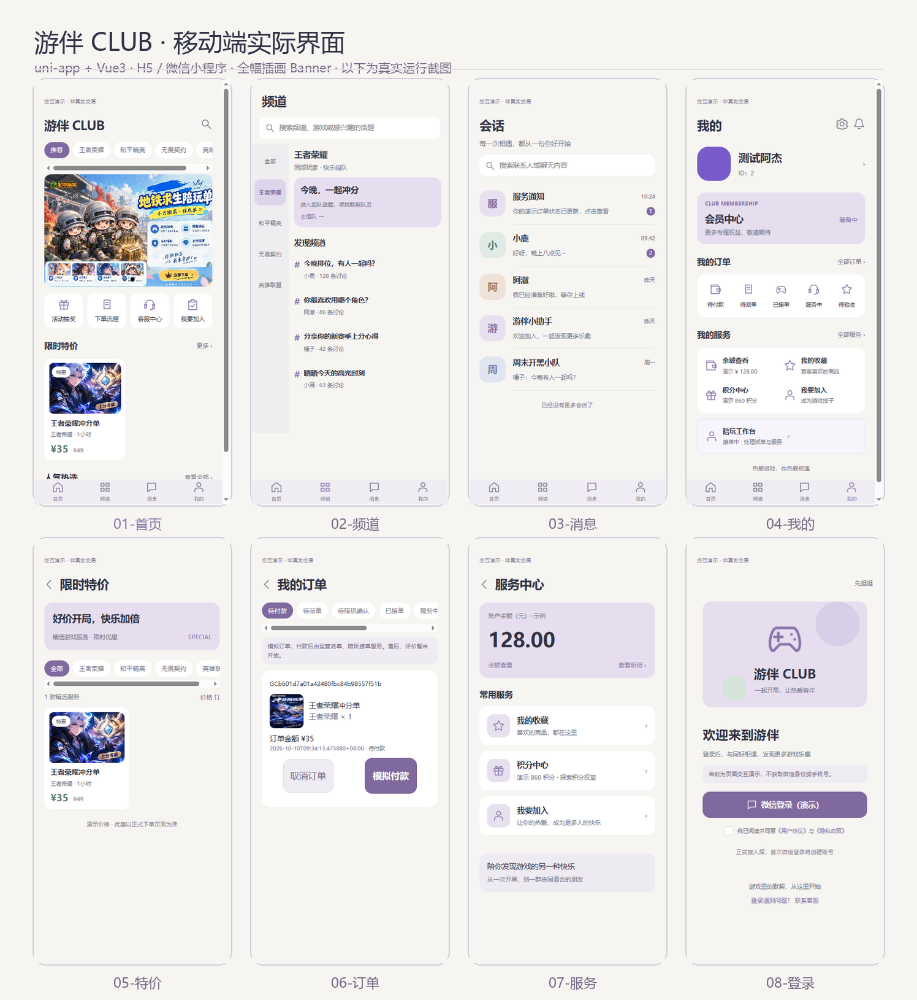
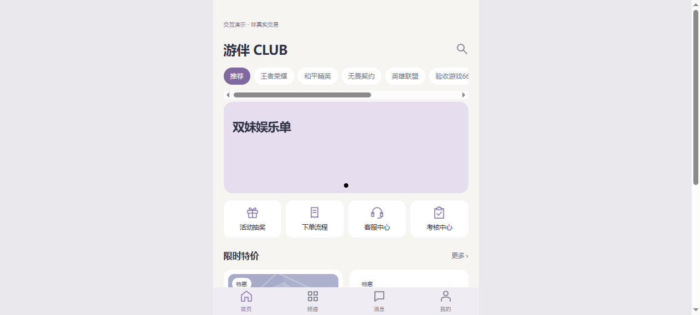
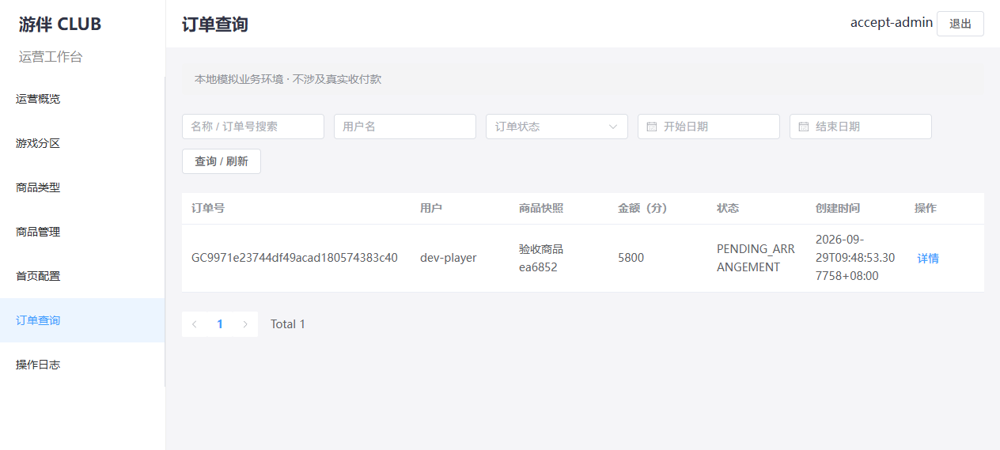

# 🎮 GamesClub — 游戏陪玩俱乐部系统

一个面向**游戏陪玩俱乐部**的客户服务与内部管理系统：客户用**微信小程序**浏览游戏、下单预约、付款；运营与管理员用 **Web 后台**管理游戏、商品、首页配置和订单。两端共用同一套 **Python 后端** 和 **PostgreSQL** 主数据库，账号、订单、商品不维护双份真值。

> 当前进度：第三阶段（本地模拟业务联调）已闭环，P3 真实微信登录已打通真机，**P4 订单与派单服务已完成**（陪玩入驻审核、人工派单、订单状态机、管理端订单增删改查）。仍属本地开发验证阶段，未部署生产。

---

## ✨ 已完成的功能

### 1. 客户小程序（uni-app + Vue 3 + TypeScript）

温和配色（暖白 / 浅灰紫 / 柔和绿）的八页设计已落地为可交互页面，并接入真实后端：

| 页面 | 功能 |
| --- | --- |
| 首页 | 游戏分区筛选、商品搜索、轮播 / 特价 / 人气配置（全幅插画 banner 轮播）、四快捷入口 |
| 频道 / 消息 | 话题切换与搜索、会话搜索与草稿（本地演示） |
| 商品详情 | 服务端商品详情、封面、数量范围、下单 |
| 订单 | 下单选预约时段、8 态状态机（待付款→待派单→待陪玩确认→已接单→服务中→待验收→已完成）、付款 / 取消 / 验收 |
| 我的 | 收藏、服务、登录态管理、**陪玩工作台**（接单 / 拒单 / 开始 / 完成服务） |
| 登录 | **真实微信登录**（`uni.login` → 后端 `code2session` 换 openid）+ 昵称 / 头像填写 |
| 陪玩入驻 | 「我要加入」提交申请 → 管理员审核通过后进入工作台 |

设计基准（`design/` 内 8 页 SVG，可导入 Figma）：



实际运行效果（H5 端，全幅插画 banner 轮播）：



### 2. 管理后台 Web（Vue 3 + Element Plus）

独立管理端，覆盖运营日常操作，全程带审计与版本冲突保护：

- **登录 / 概览**：Session + CSRF 认证，数据看板
- **游戏 / 类型 / 商品**：增删改查、图片上传（服务端重新编码）、上下架、停用、**一键投放首页**（新增/编辑商品时直接勾选轮播/特价/人气，自动同步首页配置，无需重复新增）
- **首页配置**：轮播 / 特价 / 人气条目编排
- **订单**：增删改查 + 人工派单（指定接单中的陪玩，含时段冲突检查）
- **陪玩**：入驻申请审核（通过 / 驳回）、陪玩档案管理（绑分区 + 接单开关 + 编辑 / 删除，有未完成订单时删除受保护）
- **审计日志**：关键写操作全程留痕（不记录密码与 Token）



### 3. 统一后端（Django 5 + DRF + PostgreSQL）

- 多游戏分区、服务商品、账号与角色权限模型
- 订单：服务端订单号、金额快照、**8 态状态机**、幂等键（`Idempotency-Key`）并发保护
- 陪玩：入驻申请、档案、人工派单、接单 / 拒单 / 服务履约
- 收藏、模拟付款、退出撤销 Token
- 版本冲突检测（409）、修改前后日志、`X-Request-ID` 请求追踪
- **真实微信登录**：`WechatIdentity` 模型 `(appid, openid)` 唯一归并，AppSecret 仅存服务端 `.env`

---

## 🏗️ 技术架构

```
┌─────────────────────┐        ┌─────────────────────┐
│  客户微信小程序       │        │  运营/管理 Web 后台    │
│  uni-app · Vue3 · TS │        │  Vue3 · Element Plus │
└──────────┬──────────┘        └──────────┬──────────┘
           │  Bearer Token                │  Session + CSRF
           └──────────────┬───────────────┘
                          ▼
              ┌───────────────────────┐
              │   Python 后端 (Django 5 + DRF)  │
              │  core 单 app · 统一业务逻辑      │
              │  · 商品 / 订单 / 收藏 / 登录      │
              │  · 版本冲突 / 幂等 / 审计 / 微信   │
              └───────────┬───────────┘
                          ▼
              ┌───────────────────────┐
              │   PostgreSQL 17 (Docker)  │
              └───────────────────────┘
```

- **小程序**与**后台**共用同一业务后端与数据库，金额、状态、版本同源
- 管理端走 `Session + CSRF`，小程序走 `Bearer Token`，微信登录走 `code2session`

---

## 🚀 快速开始

> 详细步骤与验收边界见 [《第三阶段完成度与联调手册》](./第三阶段完成度与联调手册.md)。

### 后端

```powershell
cd backend
python -m pip install -r requirements.txt
docker compose up -d db                 # 启动 PostgreSQL 17
copy .env.example .env                  # 配置 DATABASE_URL / 微信 AppID 等
python manage.py migrate
python manage.py seed_demo              # 首次空库补示例数据
python manage.py createsuperuser        # 创建后台管理员
python manage.py runserver 127.0.0.1:8000
```

### 管理后台

```powershell
cd apps/admin
pnpm install
pnpm dev                                 # http://127.0.0.1:5174
```

### 小程序

```powershell
cd apps/miniapp
pnpm install
pnpm build:mp-weixin                     # 产物 dist/build/mp-weixin
# 微信开发者工具导入 dist/build/mp-weixin，填入 AppID
```

---

## 🧪 验收情况

| 项 | 结果 |
| --- | --- |
| 后端测试 | **45 项全部通过**（含 7 项微信登录 + 并发幂等 + 6 项订单 CRUD + P4 派单 + 商品首页投放同步 + 首页配置回归） |
| 手动双端验收 | 8 项清单全过，API 层 **23/23** 断言 |
| UI 验收 | 12 张截图留证（`notices/e2e-screenshots/`） |
| 真实微信登录 | 真机联调通过，重登不重复建号 |
| 类型检查 / 构建 | type-check + `build:h5` + `build:mp-weixin` 全过 |

验收证据与报告见 [`notices/`](./notices/)，P4 设计与实施见 [`notices/P4-订单与派单服务设计.md`](./notices/P4-订单与派单服务设计.md)，API 层可复跑 `python notices/e2e_verify.py`。

---

## 📁 目录结构

```
gamesclub/
├── apps/
│   ├── miniapp/          # 客户小程序（uni-app + Vue3 + TS）
│   └── admin/            # 管理后台 Web（Vue3 + Element Plus）
├── backend/              # Django 5 + DRF 统一后端
│   ├── core/             #   业务逻辑（模型/视图/序列化/微信登录）
│   ├── config/           #   项目配置
│   └── docker-compose.yml
├── design/               # 已选设计基准（8 页 SVG）
├── notices/              # 验收报告、截图、问题记录
├── Agent.md              # 产品与开发约束主文档
└── README.md
```

---

## 🗺️ 路线图

- [x] 第二阶段：小程序数据层 + 模拟真实产品功能
- [x] 第三阶段：运营后台 + 双端数据统一 + 端到端验收
- [x] **P3 客户数据：真实微信登录** + 昵称 / 头像填写
- [x] **P4 订单与派单服务**：陪玩入驻审核、人工派单、订单状态机、管理端订单增删改查
- [ ] P5 售后结算
- [ ] P6 发布准备（HTTPS、生产域名白名单、备份恢复、监控）

---

## 🔒 安全说明

- 微信 `AppSecret` 仅存于 `backend/.env`（已被 `.gitignore` 忽略），**不进入版本库、不下发前端、不落日志**
- 用户 openid 不落账号名（用 `SHA-256` 哈希派生用户名）
- 管理端写操作全程审计，不记录密码与 Token
