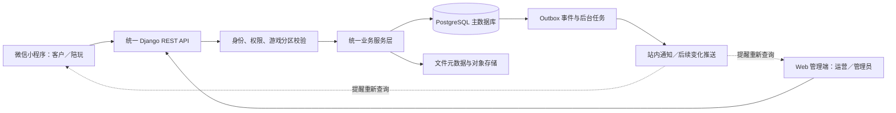

# 游戏陪玩俱乐部：项目现状与双端数据统一实施方案

## 当前进度补记（2026-09-23）

下方 V1.0 内容保留为历史基线与长期规划，不再作为第三阶段完成度清单。最新清单见 [第三阶段完成度与联调手册.md](./第三阶段完成度与联调手册.md)。

- 独立管理端实际路径为 `apps/admin/`，已实现目录运营、首页配置、上传、只读订单与日志。
- 商品详情、收藏、订单快照及状态更新已接服务端；本地频道/聊天示例和会员等未开放边界继续保留。
- PostgreSQL 17 本地容器与数据卷已建立，迁移到 core.0005；12项数据库测试全部通过，含2项并发测试，不再处于“PostgreSQL未验证”的历史状态。
- 小程序及Web构建通过，但完整浏览器/微信手动验收、后台并发编辑/上下架竞争、备份恢复、生产发布仍未完成。
- 数据库配置显式加载 `.env`；不再默认回退SQLite；旧SQLite保留。原型Web、长期业务规划不等于已实现。

版本：V1.0  
核对日期：2026-09-18  
适用范围：客户微信小程序、后续陪玩工作台、Web 管理端及统一 Python 后端。

本文依据当前工作区代码、已选温和版 SVG、`Agent.md` 和小程序运行说明编写。“已完成”指已有代码或已执行的验证；“计划”与“建议”均不表示已实现。后续业务决策以用户确认及同步更新后的 `Agent.md` 为准，接口示例须在后端开发时落实为 OpenAPI 契约。

## 1. 当前结论

**目前完成了小程序的基础页面与本地演示交互，尚未完成可运营的业务系统。**

已有 8 个设计页面、1 个共用二级详情页面；小程序可浏览、搜索、切换和进入开发模拟账号，商品目录、订单创建、订单查询和模拟付款已接入第一版后端 API，部分收藏和其他页面仍使用本地演示数据。

**目前没有 Web 管理端和真实微信／支付接入；第一版 Django＋DRF API、数据库模型和小程序部分联调已经建立。** 当前开发环境可以通过 PostgreSQL 配置运行，也支持未设置 `DATABASE_URL` 时使用本地 SQLite；商品管理仍通过管理 API／Django 管理能力完成，小程序已读取服务端商品并创建、查询和模拟付款订单。正式运营所需的 PostgreSQL 部署、权限体系、真实支付和完整跨端联调仍未完成。

后续统一方式为：

> Web 管理端与小程序均访问同一个 Django REST API，由同一业务服务层读写同一个 PostgreSQL 主数据库。Web 修改后先在服务器提交，小程序通过重新查询获得最新结果；需要更低延迟时，再添加变化通知。

这里的“同步”是两个客户端读取同一份业务记录，不是在 Web 与小程序各存一份数据后相互复制。数据库一致与屏幕及时刷新分别处理：数据库不能出现两套订单金额，离线的手机则不可能即时刷新。

## 2. 已有工程与验证证据

| 文件／目录 | 当前情况 | 用途 |
| --- | --- | --- |
| `design/01-首页.svg`～`design/08-登录.svg` | 已有、用户已选 | 暖白、灰紫与柔和绿色的客户页面设计基准 |
| `design/index.html`、`design/全部页面.svg` | 已有 | 设计预览与总览，不能执行真实业务 |
| `apps/miniapp/` | 已有 | uni-app＋Vue 3＋TypeScript 小程序工程 |
| `apps/miniapp/src/pages.json` | 已有 | 9 个实际路由、4 个原生 TabBar 入口 |
| `apps/miniapp/src/domain.ts` | 已有 | 话题、会话、展示类型和开发兜底数据；商品目录优先由 API 加载 |
| `apps/miniapp/src/store.ts` | 已有 | 本地演示登录、收藏、订单变更、未读和草稿 |
| `apps/miniapp/src/navigation.ts` | 已有 | 页面跳转、返回、演示登录引导、提示弹窗 |
| `apps/miniapp/tests/domain.test.ts` | 已有 | 筛选、金额格式与演示订单转换测试 |
| `apps/miniapp/scripts/smoke.cjs` | 已有 | H5 浏览器交互检查脚本 |
| `apps/miniapp/dist/build/mp-weixin/`、`dist/build/h5/` | 已生成 | 本轮微信与浏览器构建产物，不等于已发布 |
| `backend/` | 已建立 | Django＋DRF API、模型、迁移、开发种子数据和测试；尚未部署 |
| `apps/admin-web/` | 尚未建立 | 后续管理端 |
| `packages/api-contract/` | 尚未建立 | 后续 OpenAPI 产物与共享类型 |
| `backend/docker-compose.yml` 与 migration | 已建立 | 本地 PostgreSQL 配置和数据库迁移；尚未完成正式部署 |

上一轮实际通过了 TypeScript 检查、3 项演示逻辑测试、微信小程序构建、H5 构建及浏览器交互检查。浏览器检查覆盖四导航、四快捷入口、筛选空态、协议勾选、登录返回、演示订单、收藏、草稿、退出和受保护页面，并检查了 320px、390px、1440px 宽度下无横向溢出。

**未验证项：**微信开发者工具内运行、真实 AppID、真机、安全区与平台行为、PostgreSQL 并发、真实微信登录、正式部署及支付。后端开发测试已覆盖开发登录、订单创建、幂等和商品版本冲突；构建受当前 Windows `spawn EPERM` 环境问题影响，不能据此认定小程序已可上线运营。

## 3. 按页面梳理已完成与未完成

| 模块 | 已完成的基础交互 | 尚未完成 |
| --- | --- | --- |
| 首页 | Logo、游戏选择、商品搜索、轮播、特价／热门展示、特价更多、商品详情跳转 | 游戏、商品、轮播和排序从服务器读取；后台配置；定时发布；正式活动数据 |
| 四快捷入口 | 活动抽奖、下单流程、客服中心、考核中心按顺序横向展示，均可跳转 | 抽奖资格与发奖、考核报名及审核；流程文案后台维护；人工客服接入 |
| 频道 | 顶部搜索、侧边游戏切换、话题直接列表、话题详情与示例讨论；侧栏无独立搜索图标 | 真实话题、发布／回复、审核、分页、屏蔽与用户权限；跨设备内容同步 |
| 消息 | 演示登录引导、会话搜索、详情、演示未读清除、保存会话草稿 | 真实会话与发送／接收、服务端未读、消息持久化、实时通信、客服会话 |
| 我的 | 演示头像、昵称、ID，设置／通知入口，会员栏，五类订单和四项服务入口 | 真实用户资料、资料修改、服务端通知、角色权限、陪玩工作台 |
| 特价 | 游戏筛选、价格升降序、商品详情 | 后台优惠维护、有效期、服务端过滤／分页、价格及上架校验 |
| 商品详情 | 展示、数量 1～5 的演示选择、收藏、创建本地演示订单 | 商品人数／单位规则、意向陪玩、预约时间、区服及需求表单、服务端价格快照、真实订单 ID |
| 订单 | 五类样例、取消、模拟付款、模拟完成、模拟评价、售后说明 | 服务端创建／查单、支付记录、派单接单、改派、档期、验收、评价正文及落库、售后案件、退款与结算 |
| 服务 | 余额说明、收藏列表、积分说明、加入说明 | 真实余额／积分账本、收藏跨设备持久化、加入申请及审核；相应规则尚未确定 |
| 登录 | 协议默认未选、未勾选提示、协议页、演示登录、来源返回、先逛逛 | 微信身份换取系统登录态、令牌刷新与注销、真实账号、正式协议和隐私政策 |
| 设置／通知 | 演示模式展示、协议入口、退出演示账号、示例通知及订单跳转 | 真实账户设置、通知投递和已读状态、系统配置 |
| 页面通用能力 | 页面返回、TabBar、基本空结果、演示确认弹窗、本地图标和图片 | 统一网络请求、加载／失败重试／离线状态、401 恢复、403 权限提示、409 冲突处理、后台数据刷新 |

“模拟评价”目前只是修改示例标记，不是完整的星级与文字评价功能。“创建演示订单”只是验证跳转与列表变化，没有完成预约下单业务。

### 3.1 当前数据保存在哪里

| 数据 | 当前来源／保存方式 | 刷新、重启与退出的表现 |
| --- | --- | --- |
| 游戏、商品、话题、会话 | `domain.ts` 静态数组 | 改代码才能改变；不受后台管理影响 |
| 轮播及部分页面说明 | 页面组件内静态内容 | 不存在内容发布接口 |
| 本地演示订单及其操作 | 旧示例仍存在于 `domain.ts`／`store.ts`；正式创建、查询、取消和模拟付款已走 API | 开发联调以服务端订单为准；旧本地示例仅用于尚未接入的页面状态 |
| 会话草稿、演示未读 | 当前运行会话内存 | 不会发送；重启或退出后重置 |
| 演示登录、收藏 | `uni` storage，键 `gamesclub-ui-demo-v1` | 当前设备可恢复；退出演示账号重置；不能跨设备共享 |
| 余额、积分、会员状态 | 示例值或未开放说明 | 不存在账户资金、兑换权益或会员业务 |

当前小程序仍保留演示登录状态和部分本地收藏逻辑；服务端已提供开发 Bearer Token。正式系统退出账号后应清除客户端私人缓存，但**不能删除该用户的服务端订单、收藏或业务历史**；不要把演示中的“退出重置”复制到正式业务。

### 3.2 仍未完成的基础设施

尚未完成统一 API 的正式认证、管理端权限、文件存储、审计日志、可靠事件、后台任务、自动对账、监控、备份与恢复。当前已具备开发模拟认证、商品／订单模型、迁移、服务端定价、幂等处理、订单行锁和开发测试；前端联调仍不能代替正式环境验收。数据层本身的位置、多设备同步方式与后续环境策略见第 18 节。

## 4. 后续范围与待定事项

### 4.1 沿用的业务约束

- 面向单个俱乐部，多游戏分区；每位陪玩只能绑定并服务一个游戏。
- 同一订单的所有陪玩必须属于该订单游戏，单陪与多陪作为不同商品配置。
- 价格、数量范围、人数、单位及验收规则由管理员维护；运营不能定价，陪玩不能自行定价或授予角色。
- 第一阶段支付与结算仍使用服务端模拟方案，不接真实资金。
- 付款仅表示提交预约；派出足额人员且全部接受后才预约成功。
- 换人或改已确认时段需要客户确认；所有参与人员完成后等待客户验收。
- 退款、售后、结算独立记录；已结算与售后冻结等规则继续按 `Agent.md` 执行。

### 4.2 入口已确认但业务尚未确认

| 项目 | 开发前需确定 | 当前处理 |
| --- | --- | --- |
| 订单“待发货／待收货” | 如何归并陪玩服务状态；评价页是否同时显示已评价；取消／终止记录的入口 | 保留选定标签，不推导实物物流业务 |
| 频道 | 谁能发帖、回复、审核；搜索范围；内容可见性 | 本地话题浏览示例 |
| 消息 | 系统通知与聊天如何区分；是否纳入实时聊天、群聊和人工客服 | 仅会话草稿与通知样例 |
| 会员／余额／积分 | 权益、获取与消费规则、有效期、退款与账本 | 不开放真实能力 |
| 活动抽奖 | 参与资格、次数、奖品、库存、开奖及发奖规则 | 说明页 |
| 考核／我要加入 | 报名资料、游戏绑定、审核流程、角色授权主体 | 说明页，不授予权限 |
| 客服 | 人工服务接入渠道及服务时间 | 常见问题与流程说明 |
| 正式登录与协议 | 小程序 AppID、账号主体、正式协议文本及版本 | 演示登录与演示协议 |

本方案优先完成内容管理、商品、用户、收藏与订单服务主流程。消息／社区的真实读写以及会员等扩展模块按明确的范围逐步加入；不因画面已有按钮就默认全部纳入第一期。

## 5. 双端统一架构



| 层 | 计划技术 | 责任 |
| --- | --- | --- |
| 小程序 | 现有 uni-app＋Vue 3＋TypeScript | 渲染、表单、页面状态、调用 API；不能决定价格或支付结果 |
| 管理端 | Vue 3＋TypeScript＋Vite＋Element Plus | 管理表格、编辑、上下架、派单、审核、查询；同样调用 API |
| 后端 | Python 3.12＋Django 5.2 LTS＋DRF | 认证、权限、业务规则、状态机和接口契约 |
| 数据库 | PostgreSQL 17 | 所有正式业务的唯一数据来源，事务与约束 |
| 接口契约 | OpenAPI＋两端共享 TypeScript 类型 | 相同字段、金额单位、枚举、版本及错误码 |
| 后台任务 | PostgreSQL Outbox＋Django worker | 可重试通知、事件处理；第一期不要求 Redis／Celery |
| 部署 | Linux＋Docker Compose＋Nginx＋Gunicorn | HTTPS、环境配置、迁移、备份与服务运行 |

以上沿用项目既定技术方案；后端依赖已在 `backend/requirements.txt` 锁定主版本范围。两个客户端可以使用不同响应字段，但同一订单 ID、金额、状态与版本必须来自同一记录。任何 Django Admin、定时任务或脚本也不能绕过统一业务服务直接修改交易结果。

## 6. 哪些数据要进入统一数据库

下表是建议的完整模型边界；第一阶段已创建 User、GamePartition、Product、Favorite、Order、OrderStatusHistory、PaymentAttempt 和 IdempotencyRecord，陪玩、预约、售后、结算等表仍待后续阶段。

| 数据域 | 建议实体 | 关键字段／约束 |
| --- | --- | --- |
| 身份与权限 | User、WechatIdentity、Role、Permission、OperatorGameScope | 内部 `user_id`；`(appid, openid)` 唯一；账号启停、角色及分区范围 |
| 游戏 | GamePartition | 名称、图标、排序、启用状态、版本 |
| 商品 | Product、ProductMedia | 游戏、名称、说明、价格分、单位、人数、数量范围、状态、展示位与版本 |
| 优惠 | ProductOffer 或商品优惠配置 | 优惠价、有效期、启停、版本；若先做简单单价优惠，避免同时维护两套相互矛盾的价格 |
| 首页与说明 | Banner、NavigationEntry、ContentPage | 图片、排序、合法跳转目标、可见状态、生效时间、版本；文案草稿与发布版 |
| 陪玩 | CompanionProfile | 对应用户、唯一当前游戏、介绍、审核状态；一人只能绑定一个游戏 |
| 收藏 | Favorite | `user_id + product_id` 唯一；取消收藏不影响商品或其他用户 |
| 订单 | Order、OrderSnapshot、StatusHistory | 客户、游戏、金额分、商品与规则快照、独立状态、版本、审计记录 |
| 预约／人员 | Assignment、ReservationSlot、ChangeProposal | 逐人接受和交付状态、时段范围、换人历史、客户确认 |
| 支付与退款 | PaymentAttempt、Refund、IdempotencyRecord | 业务号、金额、状态、请求指纹、幂等键；禁止重复收款或退款 |
| 售后／评价 | AfterSaleCase、Evidence、Review | 所属订单、访问范围、处理记录；同一订单最多一个处理中售后；一单一次评价 |
| 结算 | Settlement、SettlementItem | 净收入、抽成快照、参与人、冻结和结算状态、唯一流水 |
| 站内通知 | Notification、UserNotification | 事件与接收人、内容、已读时间、目标业务 ID；已读按用户保存 |
| 可靠事件与审计 | OutboxEvent、AuditLog | 事件 ID、资源 ID／版本、投递状态、操作者、变更前后摘要、时间、原因 |
| 后续社区 | Topic、Reply、ModerationRecord | 游戏、作者、内容、公开状态、审核与删除标记；按范围决定实施 |

会员账本、积分账本、真实聊天和抽奖／考核实体待规则确认后设计，不先用一个随意可编辑的余额数字代替账本。

所有正式业务主键由后端生成，演示中的 `DEMO-*`、静态商品 ID 和 `100086` 不导入正式库。订单必须保存成交快照；目前演示页通过当前商品查询展示金额的写法，接后端时必须替换，否则后台改价会错误改变历史订单显示。

## 7. Web 增删改查怎样反映到小程序

### 7.1 通用流程

1. Web 读取数据与 `version`，用户在有权限的范围内编辑。
2. Web 提交修改内容和 `expected_version`；关键写动作附 `Idempotency-Key`。
3. 后端验证身份、角色、游戏范围、字段、版本和业务规则。
4. 在短事务内写业务数据、增加版本、记录审计及需要的 Outbox 事件。
5. 事务提交后返回最新资源。Web 更新当前行并重新查询相关列表／计数，才显示保存成功。
6. 小程序进入页面、下拉刷新或前台轮询时，读取同一 API 的公开数据；更新页面中的列表、详情、排序和数量。
7. 后续若启用推送，推送只提示变化及资源版本，小程序依然查询 API，不能直接相信推送消息里的金额或权限。

Web 保存失败或事务回滚，小程序不应看到半完成的新数据。后台发布文案、图片和商品无需重新发版小程序；增加新页面类型或新交互能力则仍需客户端代码更新。

### 7.2 按资源规定操作与展示结果

| 资源 | Web 新增／查询 | Web 修改 | Web“删除”语义 | 小程序更新结果 |
| --- | --- | --- | --- | --- |
| 游戏分区 | 管理员新增、查启停和排序；运营按授权查询 | 改名称／图标／排序；调整停用前检查相关商品及人员 | 停用，不级联删除历史订单和陪玩记录 | 启用列表重新查询后更新；停用分区不再允许新预约 |
| 商品 | 管理员维护价格；授权运营维护允许的非价格信息、上架管理 | 名称、说明、封面、价格、展示位、上下架；字段权限分开检查 | 下架／归档，不删除历史成交快照 | 列表隐藏不可售商品，旧详情禁下单；已有订单保持下单快照 |
| 优惠／热门 | 查询和配置展示；定价仍由管理员执行 | 优惠价、生效时间、特价／热门标记、排序 | 停用优惠或移除展示位 | 特价区、特价页、详情价格同步；下单再次核验有效价 |
| 轮播图 | 创建草稿、预览、发布 | 图片、文案、顺序、有效期、跳转目标 | 停用／归档 | 下次刷新只出现有效发布内容；失效目标显示可理解提示 |
| 下单流程／客服说明 | 编辑、查看草稿和发布版 | 发布新版本，保留旧版本记录 | 撤回公开发布，不删除审计记录 | 说明页查询已发布版本；撤回后提示暂无可用内容 |
| 用户／陪玩 | 管理员查账号与角色；运营仅查必要的授权数据 | 账号启停、审核；只有管理员可改角色与陪玩游戏 | 停用，不删除订单归属和历史服务记录 | 重新鉴权后限制访问；资料更新反映到允许展示的页面 |
| 订单／派单 | 查询、筛选、安排人员 | 使用派单、改派、取消审核等动作接口 | 不提供删除业务订单；使用取消／终止并保留记录 | 同一订单详情、状态、时间及操作按钮更新 |
| 售后／退款／结算 | 查询案件与待办 | 审核、退回、退款、结算均执行受约束动作 | 不删除财务流水或审核历史 | 客户查看最新处理进度；金额来自服务端计算 |
| 通知 | 查询投递、异常重试与必要的管理通知 | 修改未发布内容；已投递通知采用追加更正等明确策略 | 隐藏／归档不能删除业务事件 | 收件人只看自己的通知，已读状态跨设备一致 |
| 收藏 | 管理端无需任意编辑用户收藏 | 用户自行新增／取消；后台只管理被收藏商品 | 用户取消收藏关系；商品下架保留失效提示 | 两台设备查询同一用户收藏；下架项不能购买 |
| 频道话题（后续） | 按游戏查询、审核发布 | 编辑允许的字段，审核／隐藏；记录操作原因 | 软删除／隐藏；不把私密内容继续留在公开缓存 | 列表移除、详情变为不可用；实际互动规则另定 |

“查”也需要权限：运营不能通过搜索、导出、详情或计数查询窥见未授权分区。界面隐藏编辑按钮不构成安全控制。

### 7.3 发布规则与缓存

- 有草稿／发布之分的内容，小程序只读取发布版；Web 保存草稿不意味着立即公开。
- 游戏或商品停用必须同时在列表和下单校验生效，不能只从首页隐藏。
- 轮播有效期、优惠有效期由服务器时钟判断。到期可能无需数据库字段发生更新，因此列表刷新必须重新判断当前有效性，不能只比较某行 `updated_at`。
- 图片使用带版本或内容哈希的新文件地址；替换图片时更新资源版本和 URL，避免手机继续显示旧缓存。旧订单需要的快照资源按保留策略保存。
- 跳转类型使用白名单，例如商品、游戏、已支持的说明页面；后台不能配置任意脚本、任意内部管理路由或未校验链接。
- 首期业务列表按服务器重新查询；如未来引入缓存，必须明确失效范围。不能只清某个商品详情，却让特价列表、首页推荐和搜索结果长期保留旧数据。

## 8. 四个端到端示例

### 8.1 管理员把商品价格从 29 元改为 35 元

1. Web 读取商品版本 7，提交 `price_cents=3500`、`expected_version=7`。
2. 后端校验定价权限，锁定记录，更新为版本 8并记录审计。
3. Web 显示新价格；小程序下次刷新看到 35 元。
4. 如果手机还显示旧价，提交订单携带版本 7，后端返回商品版本冲突；小程序展示新价并由用户重新确认，不能悄悄扣更高金额。
5. 已创建订单继续使用原有价格快照，不随商品改价变化；后续支付也按订单金额处理。

优惠或到期价格的变化同样需要服务端核验。若采用独立优惠表，订单请求还应携带报价版本／报价标识；具体报价契约在优惠模型确定后定稿。

### 8.2 运营下架一件商品

Web 提交下架动作，后端保存不可售状态。小程序已打开的详情下次刷新后显示“已下架”；即使刷新前点击下单，服务器也应拒绝创建。收藏列表显示失效项或允许用户取消收藏；已有订单仍能查看原商品快照，不被商品下架删除。

### 8.3 小程序提交订单，Web 派单

客户经过真实登录提交预约信息，服务器生成订单与快照。Web 查询同一订单记录。模拟付款成功后，运营按游戏选择符合条件的人员；陪玩逐人确认，由数据库检查时段冲突，足额接受后状态变为已预约。小程序重新查询同一订单即可看到人员和安排；不需要把订单再“复制”给 Web。

### 8.4 Web 审核退款，小程序查看进度

退款审核锁定订单并预留可退金额，生成退款记录。结果确认成功后，在事务内更新退款流水、累计退款、订单相关状态及收益计算，并记录通知事件。小程序显示服务端返回的申请／处理／成功／失败状态；通知丢失不影响查到已提交结果。若退款结果未知，显示处理中并继续查单，不能当作失败再重复退一次。

## 9. 刷新、延迟与失败处理

### 9.1 第一阶段采用查询与前台轮询

| 场景 | 建议策略 | 展示结果 |
| --- | --- | --- |
| 页面首次进入、`onShow`、切换游戏／筛选 | 立即查询对应列表或详情 | 使用当前筛选的数据 |
| 手动下拉刷新 | 立即查询并在结束时停止刷新提示 | 成功更新；失败显示原因并允许重试 |
| 活跃订单、派单、售后页面 | 前台默认每 5 秒查询 | 在下一次成功刷新中看到后台变化 |
| 首页、商品、一般管理列表 | 前台默认每 15 秒查询当前数据 | 发布、下架、排序等变化逐步体现 |
| 当前客户端写操作成功 | 用返回资源更新，并使相关列表／计数失效重查 | 当前端立即获得本次提交结果 |
| 隐藏、卸载、退出登录 | 停止计时器和请求；必要时清私人缓存 | 避免后台重复轮询或串账号 |
| 回到前台、网络恢复 | 立即重新查询，恢复正常轮询 | 弥补挂起或断网期间的变化 |
| 请求失败 | 退避重试，显示更新失败和最后成功时间 | 不把旧结果标记为最新 |

5 秒／15 秒是刷新频率，不是绝对实时承诺；请求耗时、网络中断、手机后台挂起都会增加延迟。第一期无需为了“同步”先构建聊天式长连接。

### 9.2 防止旧请求覆盖新界面

- 同一资源只接收不低于当前 `version` 的结果。
- 列表请求同时绑定账号、游戏、筛选、排序和请求序号；切换条件后废弃旧请求结果。
- 删除／下架不一定出现在新列表中。首期重新查询并替换当前列表，同时使相关分页失效，不能只合并新增项而保留已移除商品。
- 若以后做增量同步，必须设计删除标记、分页游标、保留期限及过期后的全量重建。不能直接用“自增 ID 大于上次 ID”当可靠提交顺序，否则并发事务可能漏变更。
- 金额、订单状态和预约安排不做无条件乐观成功。提交中禁重复按钮；最终显示以服务器结果为准。
- 超时结果不明时使用原幂等键查结果，不创建新的业务请求；失联只允许查看标记为缓存的数据或保存本地表单草稿。

### 9.3 后续需要推送时

后端在业务事务内写 Outbox。worker 读取已提交事件，向有权限的用户投递变化提示，例如 `resource_type=order`、`resource_id`、`version`。客户端收到后使查询失效并刷新。

事件处理允许重复，消费者按事件 ID 去重；断线重连仍查询补偿。通知授权必须跟随账号与分区权限变化，不广播整个订单或私人数据。WebSocket 是降低等待时间的手段，不替代数据库、鉴权、查单或幂等。

## 10. 接口契约建议

以下路径与字段是后续开发建议，**当前均未实现**。订单、支付等最终结构应先写入 OpenAPI，再生成两端类型。

### 10.1 接口分组

| 分组 | 示例接口 | 用途 |
| --- | --- | --- |
| 身份 | `POST /api/v1/auth/wechat-login/`、刷新、注销、当前用户 | 小程序身份与登录态 |
| 后台身份 | `/api/v1/auth/management-login/` | 员工 Session 登录，管理接口限定认证方式 |
| 公开目录 | `GET /api/v1/catalog/games/`、`products/`、`products/{id}/` | 公开且启用的游戏及可售商品 |
| 首页／说明 | `GET /api/v1/content/home/`、`pages/{key}/` | 轮播、入口、推荐、已发布说明 |
| 收藏 | `GET /api/v1/me/favorites/`、`PUT/DELETE .../{product_id}/` | 当前用户收藏关系；重复收藏不生成多条 |
| 客户订单 | `GET/POST /api/v1/me/orders/`、`GET .../{id}/` | 创建与查询本人订单 |
| 订单动作 | `POST .../{id}/cancel/`、`confirm-delivery/`、`reviews/` | 校验状态后执行动作 |
| 模拟支付 | `POST .../{id}/mock-payments/` | 仅隔离开发／演示环境开放 |
| 售后 | `/api/v1/me/orders/{id}/aftersales/` | 申请及查询本人案件 |
| 陪玩 | `/api/v1/companion/assignments/` 及接受／拒绝／开始／完成动作 | 本人服务任务 |
| 管理目录 | `/api/v1/management/games/`、`products/`、`banners/`、`content-pages/` | 管理 CRUD、上下架及发布 |
| 管理订单 | `/api/v1/management/orders/` 及派单／改派动作 | 按分区运营 |
| 管理售后 | `/api/v1/management/aftersales/` 及审核／退款动作 | 授权处理案件 |
| 管理账号 | `/api/v1/management/users/`、`roles/`、`companions/` | 账号、角色和游戏范围管理 |
| 通知 | `/api/v1/me/notifications/`、已读动作 | 本人站内通知，不等同聊天 |

交易资源不提供任意 `PATCH status/paid/refund_total/earnings`；通过动作接口进入统一业务服务。普通编辑 API 也按角色限制字段，不能因为允许改封面就同时允许改价格。

### 10.2 统一字段与响应

- ID 使用服务器分配的字符串标识；金额用整数分，币种为 `CNY`。
- 时间在库中按 UTC 保存，API 输出带时区 ISO 8601，小程序和 Web 默认按 `Asia/Shanghai` 展示。
- 可编辑资源输出 `version`、`updated_at`；分页统一为已约定的游标／页码格式，不混用。
- 公共响应不能包含手机号、后台备注、成本、抽成等内部字段。
- 错误使用正确 HTTP 状态及稳定 `code`、可读 `message`、`request_id`、必要字段错误；不能全部返回 HTTP 200。
- 页面表单校验负责体验；权限、上下架、数量范围、价格、状态和档期由后端再次校验。

商品修改示例：

```http
PATCH /api/v1/management/products/product_123/
Content-Type: application/json

{
  "price_cents": 3500,
  "expected_version": 7
}
```

成功后的资源示例：

```json
{
  "id": "product_123",
  "price_cents": 3500,
  "currency": "CNY",
  "status": "published",
  "version": 8,
  "updated_at": "2026-09-18T02:30:00Z"
}
```

冲突示例（HTTP 409）：

```json
{
  "code": "VERSION_CONFLICT",
  "message": "该商品已被更新，请刷新后确认修改",
  "request_id": "request_example",
  "current_version": 8
}
```

建议错误码包括 `VERSION_CONFLICT`、`PRODUCT_UNAVAILABLE`、`PRICE_CHANGED`、`SCHEDULE_CONFLICT`、`INVALID_ORDER_STATE`、`REFUND_AMOUNT_EXCEEDED`、`IDEMPOTENCY_CONFLICT`。401 处理登录态，403 处理权限；对无权访问的私人对象可统一返回 404，避免泄露其存在性。

### 10.3 幂等与编辑冲突

同一业务意图生成一次 `Idempotency-Key`，网络重试复用；后端保存操作者、动作、请求摘要与结果。同键同请求返回原结果，同键不同请求拒绝；仅有前端禁用按钮不够。

版本冲突时，Web 保留用户未提交表单、展示最新资源并要求重新确认；小程序刷新价格或安排后重新确认。对 `expected_version` 不匹配的结果不允许“最后保存者覆盖一切”。

## 11. 交易、并发与权限保障

### 11.1 数据库事务

订单创建、价格快照、金额记录、状态历史和审计应在同一短事务中提交或回滚。Django 的 `atomic()` 可定义这样的原子提交范围；数据库回滚后仍须注意撤销或重新加载进程内已变更的对象状态。[Django 官方事务说明](https://docs.djangoproject.com/en/5.2/topics/db/transactions/)

修改订单及资金相关动作先锁定订单，再校验当前状态、版本和剩余金额。两个管理员同时编辑只允许符合版本条件的一方提交；跨多个资源按固定顺序加锁。调用外部支付／通知服务不放在持锁事务内。

业务和 Outbox 同事务保存，提交后由 worker 投递。单独使用内存回调不能保证进程崩溃后事件仍可重试。

### 11.2 档期与资金

- 档期按实际每个服务时间段记录，使用 `[开始, 结束)`；待邀请不占档期，接受后才建立占用。
- PostgreSQL 的范围类型与排斥约束可限制同一人员时段重叠；项目需配合人员键和相应扩展实施，并在真实 PostgreSQL 中测试并发。[PostgreSQL 官方范围与约束说明](https://www.postgresql.org/docs/17/rangetypes.html#RANGETYPES-CONSTRAINT)
- 同一订单不能因两个人同时接单而超过人数；最后一位确认时重新检查足额与游戏一致性。
- 支付／退款必须有唯一业务约束，超时查单而非重复发起；退款预留金额要扣除其他处理中退款。
- 未结束售后、未确认退款结果或服务未满足完成条件时不能结算。抽成、均分和分币余数由统一后端计算。
- 如果商品或陪玩游戏状态在下单／接单期间改变，相关动作必须共用锁定和重查约定，不能用旧查询结果继续提交。

### 11.3 身份、角色与分区

| 角色 | 可操作范围 | 明确限制 |
| --- | --- | --- |
| 客户 | 公开商品、自己的收藏、订单、评价、售后与通知 | 不可读取他人私人资源，不能提交最终价格或角色 |
| 陪玩 | 本人参与的任务与收益、允许修改的介绍 | 不能跨游戏、改价或自行获得接单资格 |
| 运营／接待 | 授权游戏分区的派单、服务跟进、允许的商品维护及售后操作 | 不能跨分区、定价或任意授予权限；退款权限按授权动作校验 |
| 管理员 | 角色、账号、分区、价格、复核与结算 | 同样受事务、幂等、审计和合法状态约束 |

小程序微信身份映射到内部 `user_id`；计划使用短期 Access Token 与可轮换 Refresh Token。管理 Web 使用 Session＋HttpOnly/Secure Cookie＋CSRF。认证方式不同不影响两端使用相同 User 和权限体系；AppSecret 仅在后端保存。

查询集过滤、对象访问和创建／修改动作需分别做权限检查；DRF 的对象权限不会自动替代所有列表与创建逻辑的授权。[DRF 官方权限说明](https://www.django-rest-framework.org/api-guide/permissions/)

权限撤销后下一次请求应失败并清理失效展示；不能等待前端自己隐藏按钮才生效。多账号切换必须废弃前一账号的请求、缓存和推送订阅。

## 12. 现有小程序如何改造

不重画已选页面，优先替换数据来源与业务动作。

| 当前实现 | 后续改造 |
| --- | --- |
| `domain.ts` 中静态商品、话题和消息 | 保留为隔离的 mock 数据；正式模式改为对应查询服务，逐个页面接入 |
| `store.ts` 的 `loggedIn` | 真实会话管理、当前用户查询、刷新令牌与注销；前端布尔值仅派生显示状态 |
| `createDemoOrder()` | 调用创建订单 API，补预约表单、校验、请求幂等、冲突恢复；使用后端返回 ID |
| `actOrder()` | 按动作调用 API，再使用服务端返回资源更新；移除客户端决定交易最终状态的代码 |
| 页面通过当前 `products` 计算订单金额 | 使用订单的成交快照、数量与服务端金额，避免商品改价改坏历史订单 |
| 本地 `favorites` | 读取当前用户收藏 API；新增与取消调用幂等关系接口 |
| `read` 与示例通知 | 对接本人通知列表、已读动作和服务端未读数量 |
| 草稿保存 | 可保留本地草稿，但按真实用户和会话隔离；消息发送若纳入范围需另建服务端流程 |
| 页面内轮播和说明常量 | 接已发布内容 API；渲染支持的类型和合法目标 |
| `onLoad` 初始化 | 增加 `onShow`、下拉刷新、可见性控制、请求取消和轮询退避 |
| 简单 toast 提示 | 增加加载、空数据、更新失败、离线、未授权、版本冲突和结果未知状态 |

建议新增小程序 `src/api/`（传输与错误）、`src/services/`（按业务组织请求）、`src/stores/`（会话及查询缓存）；后端定义 schema 后生成 `packages/api-contract/`。Web 复用接口类型与少量纯函数，不共享小程序 DOM、路由、登录存储或网络实现。

正式模式必须显式配置 API 地址；连接失败不能偷偷退回演示数据并继续显示支付成功。开发、测试与正式构建标识和模拟接口必须隔离。演示设备存储不会迁移到正式数据库，联调使用服务器显式生成的种子数据。

## 13. Web 管理端第一期页面清单

| 页面 | 基础能力 | 依赖 |
| --- | --- | --- |
| 登录与权限框架 | 员工登录、退出、账号停用提示、按权限菜单 | 统一 User、Session、权限 API |
| 游戏管理 | 查询、新增、排序、启停 | 游戏模型与关联校验 |
| 商品管理 | 游戏筛选、详情、编辑、封面、价格、上架／下架、特价／热门配置 | 商品与文件 API、版本检查、字段权限 |
| 首页／说明管理 | 轮播草稿与发布、四入口目标、流程／客服说明 | 发布模型、白名单目标、图片管理 |
| 用户／陪玩管理 | 查询、启停、审核、角色、唯一游戏绑定 | 身份权限及活跃订单约束 |
| 订单管理 | 列表、详情、筛选、状态历史、派单／改派、客户确认进度 | 完整订单与人员服务层 |
| 售后管理 | 案件、凭证、审核、退款结果、失败／未知处理 | 售后、模拟支付、私有附件 |
| 收益与结算 | 待结算、冻结原因、模拟结算、历史明细 | 净收入、抽成、人员记录和结算约束 |
| 审计／异常 | 谁改了什么、版本冲突、事件重试、退款未知 | AuditLog、Outbox 与日志 |

客户小程序的八页视觉不能直接当管理 Web 布局使用。管理端使用桌面表格和表单，细化界面时保留项目配色即可；权限和业务规则必须来自同一服务端。

## 14. 实施顺序与每阶段交付

| 阶段 | 具体工作 | 完成标志 |
| --- | --- | --- |
| P0：规则与契约 | 定稿第一期范围、订单展示映射、身份与权限表、商品单位／人数／预约字段；建立 OpenAPI | 无需猜测关键金额、权限和状态语义即可开发 |
| P1：后端基础 | Django、DRF、PostgreSQL、迁移、环境配置、User／权限、认证、日志、分页与错误规范 | 小程序和 Web 都能识别同一后端用户，禁止跨角色访问 |
| P2：内容与商品闭环 | 游戏、商品、图片、轮播、说明、上下架、版本控制；最小管理 Web CRUD；小程序改用 API | Web 改价／下架／发布后，小程序按刷新策略看到正确变化 |
| P3：客户数据 | 真实微信登录、本人资料、收藏、站内通知；移除正式模式本地账号假数据 | 同一用户在两台设备看到相同收藏；他人不可访问 |
| P4：订单与服务 | 预约、成交快照、模拟支付、派单、逐人确认、档期、换人、交付、验收及评价 | 小程序下单、Web 派单、陪玩确认、客户验收完整走通 |
| P5：售后与结算 | 售后凭证、退款幂等、收益冻结、模拟结算、审计与可靠事件 | 并发和失败场景下无超退、重复结算或丢失记录 |
| P6：发布准备 | 微信开发者工具、真机、安全区、网络域名、HTTPS、部署、备份恢复、监控 | 在目标环境完成可复现的端到端验收 |
| 后续扩展 | 经确认的社区互动、实时聊天、会员／积分、抽奖、考核等 | 每项均有规则、API、权限、异常与测试后再开放 |

最先应做的可验收切片是 **“管理员新增／修改／下架商品 → 数据库落库 → 小程序显示与下单校验”**，无需先把整个 Web 后台画完，也无需先引入实时推送。它能够及早证明双端统一方式正确。

## 15. 跨端验收清单

下列均为后续目标，当前尚未通过真实后端联调。

| 编号 | 操作／故障 | 必须看到的结果 |
| --- | --- | --- |
| A01 | Web 创建草稿商品，再发布 | 草稿不在小程序公开列表；发布后出现，字段一致 |
| A02 | Web 改价，手机保持旧详情并提交 | 小程序得到冲突提示和新价；未经重新确认不按新价成交 |
| A03 | 修改商品价格后查看历史订单 | 历史成交金额、人数与规则快照保持原值 |
| A04 | Web 下架，手机立即尝试下单 | 服务端拒绝新单；刷新后列表移除；历史订单仍可查询 |
| A05 | 修改轮播顺序、替换图片、到期撤回 | 小程序刷新呈现新顺序与新图片，到期内容不再展示 |
| A06 | 两个管理员用同一版本编辑 | 一方成功，另一方 409；不静默覆盖 |
| A07 | 客户在设备 A 收藏，在设备 B 查询 | 同一账号结果一致；退出不删除服务端收藏 |
| A08 | 小程序创建订单，Web 查询／派单 | 同一 ID、金额、快照、人员与版本，不出现第二份订单 |
| A09 | 多人并发接单、人员时段重叠 | 数据库阻止超人数与重复占用，失败事务回滚 |
| A10 | 重复付款、取消、退款、结算请求 | 每个业务意图只有一次有效结果，财务流水不重复 |
| A11 | 提交成功但响应超时 | 原幂等键能查到结果；客户端不重复创建 |
| A12 | 并发退款或退款与结算同时发生 | 不超出剩余可退金额，不在冻结条件下结算 |
| A13 | 运营访问其他游戏、客户访问他人订单 | 服务端拒绝列表、详情、统计、附件及动作请求 |
| A14 | 撤销权限／停用账号后继续请求 | 下一次鉴权生效，客户端清理不再允许展示的数据 |
| A15 | 搜索后快速切游戏，旧响应晚到 | 旧结果不覆盖当前筛选；切账号不串数据 |
| A16 | 手机隐藏、断网、重连或重启 | 后台停止轮询；恢复后查询补偿；离线不执行交易写操作 |
| A17 | worker 中断、事件重复投递 | 业务记录仍可查询，事件可重试且不会重复退款或结算 |
| A18 | 删除／停用关联商品、游戏或人员 | 不破坏历史订单、参与者及审计；活跃业务限制被执行 |
| A19 | 微信开发者工具与真机运行 | 导航、登录、长列表、输入、安全区、网络失败与恢复符合预期 |
| A20 | 数据库从备份恢复 | 订单、用户、交易与文件关联可核对，恢复步骤有记录 |

当前的前端单元测试和 H5 点击检查继续保留，但不能替代 API 权限、真实 PostgreSQL 事务／锁、并发测试和微信真机验证。

## 16. 部署与运行维护要求

- Web 静态资源和 API 建议通过同一 HTTPS 域名反向代理；小程序配置对应请求／文件域名。开发、测试、正式环境分别使用数据库、文件存储和微信配置。
- 数据库账号、AppSecret、支付密钥等只在后端环境变量或秘密管理中配置，不写入小程序包、Web 包或版本库。
- 商品封面等公开资源与售后凭证等私有文件分开处理；私有下载每次验证用户和业务关系。
- 部署执行数据库迁移并有回滚／兼容方案。小程序版本存在发布滞后，API `v1` 内优先兼容新增字段，破坏性改动走新版本与过渡期。
- 监控 API 错误、响应时长、锁冲突、未知支付／退款、Outbox 积压和备份状态；日志关联 `request_id`、业务 ID 和操作者，避免写入明文凭据。
- 数据库持久卷不等于备份。数据库及相关文件都需备份、保留策略和实际恢复演练；上线前确定可接受的数据损失与恢复时间目标。

## 17. 文档维护与下一步

本文件负责项目现状、交付缺口和双端统一实施方案；`Agent.md` 继续作为业务与开发约束；小程序 `README.md` 负责运行、导入和演示说明。功能完成后应同步更新三者相关部分，并附实际验证结果。

下一步建议从 P0／P1 开始，尽快完成 P2 商品管理闭环。届时第一次真正验证的结果应是：**Web 保存一条商品变更，数据库只有一份记录，小程序在下一次成功查询中显示它，旧价格和无权限操作同时被后端正确拒绝。**

## 18. 数据层与环境策略（2026-10-02 补记）

### 18.1 数据实际保存在哪里

| 内容 | 保存位置 | 是否随版本库同步 |
| --- | --- | --- |
| 业务数据（游戏、商品、订单、收藏、审计） | 本机 PostgreSQL 17，容器 `backend-db-1`，数据卷 `backend_gamesclub_pgdata` | 否 |
| 上传文件与商品图 | `backend/media`（`MEDIA_ROOT`），已在 `.gitignore` | 否 |
| 小程序端收藏、草稿、登录态 | 设备侧 `uni` storage | 否，本就按设备本地设计 |
| 代码、迁移、演示种子命令 | 版本库 | 是 |

因此换一台电脑执行 `git clone` 后代码一致，但数据库为空，需要执行 `migrate` 与 `seed_demo` 重建演示数据；`seed_demo` 只补缺失数据，不覆盖既有商品，也不创建或提升管理员。数据库持久卷不等于备份，本机卷同样存在丢失风险。

### 18.2 决策：暂不引入云端数据库

- 现状已经具备切换能力：`DATABASE_URL` 完全由环境变量提供，代码中没有硬编码连接或本地路径依赖，改为云端只需替换环境变量，不需要改动业务代码。
- 由此可知，上云不是需要提前设计的架构决策，而是随时可执行的配置切换。在 18.3 的触发条件出现之前不投入，避免用一份暂时用不到的外部依赖换取更低的可复现性。
- 当前继续使用本地 PostgreSQL 的收益是零成本、可随时重置、便于完成事务与锁行为验收。本机没有 PostgreSQL 服务时，不得用 SQLite 的运行结果替代 PostgreSQL 的结论。

### 18.3 必须切换到共享数据库的触发条件

出现以下任一情况即执行，不再重新评估：

1. 需要微信真机预览，或提交体验版／正式版；手机无法访问 `127.0.0.1`。
2. 出现第二台需要共享同一份业务数据的开发机器。
3. 开始产生需要保留的真实用户数据。

### 18.4 触发条件出现前应先完成的三项

1. **数据可复现（P-A）**：将演示数据导出为版本库内的 fixture，并在导出时排除 `contenttypes`、`auth.permission`、`sessions`、`core.accesstoken`、`core.auditlog`；同时提供一条在新机器上重建演示数据的命令。验收标准是任何人克隆后执行固定命令即可得到与本机一致的演示数据。不得导出真实用户数据与登录令牌。
2. **数据库接入说明（P-B）**：新增一页文档，写明本地与云端两种接入方式、`DATABASE_URL` 的读取优先级、凭据只放环境变量的原因，以及媒体文件同样需要对象存储才能跨设备共享。当前这些约定只存在于代码和零散文档中，尚未形成可交接的说明。
3. **真机链路（P-C）**：使用隧道获得临时 HTTPS 域名指向本机后端，配置小程序 request 合法域名完成真机验证。此步只用于打通链路，不等于正式部署，也不替代备案与正式域名。

### 18.5 本节明确不做的事

- 不用提交 SQLite 文件的方式跨设备同步数据：二进制文件容易冲突，且当前验收以 PostgreSQL 为准。
- 不为完整外观提前购买云服务器或域名；国内部署涉及备案，与当前阶段目标不匹配。
- 不在代码、文档或示例中写入真实 AppSecret、数据库口令与生产地址；`.env.example` 只保留占位符。
